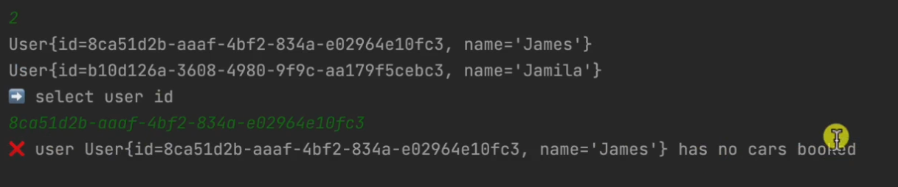
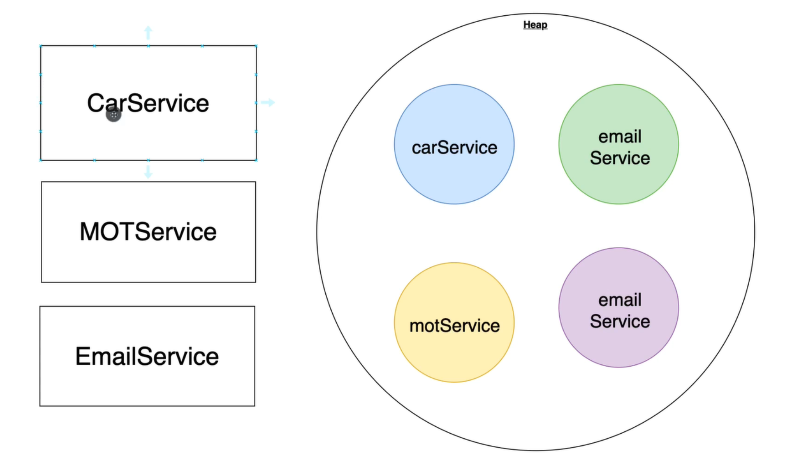
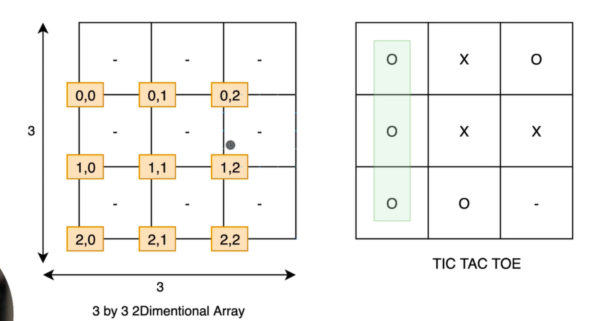

# Java_Master_Class_2023-1
- [Java\_Master\_Class\_2023-1](#java_master_class_2023-1)
  - [what is java ✅](#what-is-java-)
  - [what can u build with java ✅](#what-can-u-build-with-java-)
  - [Backend and Who use JAVA ✅](#backend-and-who-use-java-)
  - [java is not javascript ✅](#java-is-not-javascript-)
    - [compiler ✅](#compiler-)
    - [interpreter ✅](#interpreter-)
    - [comparison ✅](#comparison-)
  - [Static vs Dynamic type checking ✅](#static-vs-dynamic-type-checking-)
  - [java history ✅](#java-history-)
  - [Create Project - Part 1 ✅](#create-project---part-1-)
  - [Compiling and Running via Terminal ✅](#compiling-and-running-via-terminal-)
  - [View ByteCode ✅](#view-bytecode-)
  - [Public Static Void Main ✅](#public-static-void-main-)
  - [Reserved Keywords ✅](#reserved-keywords-)
  - [Comments ✅](#comments-)
  - [Variables ✅](#variables-)
  - [Primitives Data Types Difference ✅](#primitives-data-types-difference-)
  - [Numeric Literals with Underscore ✅](#numeric-literals-with-underscore-)
  - [Arithmetic Operators ✅](#arithmetic-operators-)
  - [Increment and Decrement Operators ✅](#increment-and-decrement-operators-)
  - [Comparison Operators ✅](#comparison-operators-)
  - [Short hand re-assignment ✅](#short-hand-re-assignment-)
  - [Naming Variables ✅](#naming-variables-)
  - [Strings ✅](#strings-)
  - [String API Documentation ✅](#string-api-documentation-)
  - [Reference Types and Objects ✅](#reference-types-and-objects-)
  - [Reference Types and Objects Diferences ✅](#reference-types-and-objects-diferences-)
  - [Pass py value with Primitives ✅](#pass-py-value-with-primitives-)
  - [Pass py value with Reference Types ✅](#pass-py-value-with-reference-types-)
  - [Arrays ✅](#arrays-)
  - [0 and Null Values for Arrays ✅](#0-and-null-values-for-arrays-)
  - [For Loop ✅](#for-loop-)
  - [Loops and Arrays ✅](#loops-and-arrays-)
  - [Enhanced For Loop ✅](#enhanced-for-loop-)
  - [For i vs Enhanced For Loop ✅](#for-i-vs-enhanced-for-loop-)
  - [While Loop ✅](#while-loop-)
  - [Do While  ✅](#do-while--)
  - [If Statements ✅](#if-statements-)
  - [Else If ✅](#else-if-)
  - [AND Logical Operators ✅](#and-logical-operators-)
  - [OR Logical Operators ✅](#or-logical-operators-)
  - [Logical Operators Recap ✅](#logical-operators-recap-)
  - [! on ifs ✅](#-on-ifs-)
  - [Dont do this with if statements ✅](#dont-do-this-with-if-statements-)
  - [Switch Statement ✅](#switch-statement-)
  - [Data Types for Enums ✅](#data-types-for-enums-)
  - [New Switch Expression ✅](#new-switch-expression-)
  - [Packages ✅](#packages-)
  - [Creating Packages ✅](#creating-packages-)
  - [Exploring Packages ✅](#exploring-packages-)
  - [Import keyword ✅](#import-keyword-)
  - [Optimizing imports ✅](#optimizing-imports-)
  - [Import with fully qualified name 🔲](#import-with-fully-qualified-name-)
  - [No Import for java lang  ✅](#no-import-for-java-lang--)
  - [Access Modifiers Intro ✅](#access-modifiers-intro-)
  - [Public Access Modifier ✅](#public-access-modifier-)
  - [Private ✅](#private-)
  - [Default ✅](#default-)
  - [Recap ✅](#recap-)
  - [When To Use Each Access Modifier 🔲](#when-to-use-each-access-modifier-)
  - [Static Keyword 🔲](#static-keyword-)
  - [Methods ✅](#methods-)
  - [Method that add 2 numbers ✅](#method-that-add-2-numbers-)
  - [Parameters and Arguments ✅](#parameters-and-arguments-)
  - [Void methods ✅](#void-methods-)
  - [Naming Convention ✅](#naming-convention-)
  - [Exercise ✅](#exercise-)
  - [Exercise Solution ✅](#exercise-solution-)
  - [Understanding public static void main ✅](#understanding-public-static-void-main-)
  - [Program Arguments ✅](#program-arguments-)
  - [Type Inference with Var ✅](#type-inference-with-var-)
  - [Break Keyword and Loops ✅](#break-keyword-and-loops-)
  - [Continue ✅](#continue-)
  - [Return Keyword and Void Methods ✅](#return-keyword-and-void-methods-)
  - [Final Keyword ✅](#final-keyword-)
  - [Enums ✅](#enums-)
  - [Enums Methods ✅](#enums-methods-)
  - [Implicit and Explicit Type Casting ✅](#implicit-and-explicit-type-casting-)
  - [Global and Local Variables ✅](#global-and-local-variables-)
  - [Wrapper Classes ✅](#wrapper-classes-)
  - [Working With Strings ✅](#working-with-strings-)
  - [How Strings are stored in memory ✅](#how-strings-are-stored-in-memory-)
  - [Strings are Immutable ✅](#strings-are-immutable-)
  - [String Literal vs String Object ✅](#string-literal-vs-string-object-)
  - [Comparing Strings with == ✅](#comparing-strings-with--)
  - [Comparing Strings with .equals ✅](#comparing-strings-with-equals-)
  - [Useful String static Methods ✅](#useful-string-static-methods-)
  - [LocalDateTime ✅](#localdatetime-)
  - [LocalDate and LocalTime 🔲](#localdate-and-localtime-)
  - [Creating Specif Dates 🔲](#creating-specif-dates-)
  - [ZoneIds 🔲](#zoneids-)
  - [Other Date Classes 🔲](#other-date-classes-)
  - [The Problem With double 🔲](#the-problem-with-double-)
  - [BigDecimal 🔲](#bigdecimal-)
  - [Exploring BigDecimal Methods  🔲](#exploring-bigdecimal-methods--)
  - [Scanner 🔲](#scanner-)
  - [NextInt and other data types 🔲](#nextint-and-other-data-types-)
  - [Outro 🔲](#outro-)
  - [Intro 🔲](#intro-)
  - [What is an exception 🔲](#what-is-an-exception-)
  - [Try Catch 🔲](#try-catch-)
  - [Multiple Catch Blocks 🔲](#multiple-catch-blocks-)
  - [Using Or Within Catch 🔲](#using-or-within-catch-)
  - [The Exception Class 🔲](#the-exception-class-)
  - [Finally Keyword 🔲](#finally-keyword-)
  - [Exception Hierarchy 🔲](#exception-hierarchy-)
  - [Uncheck Exceptions 🔲](#uncheck-exceptions-)
  - [Checked Exceptions 🔲](#checked-exceptions-)
  - [Throw and Throws 🔲](#throw-and-throws-)
  - [Throwing Exceptions 🔲](#throwing-exceptions-)
  - [When To Use Checked VS Unchecked Exeptions 🔲](#when-to-use-checked-vs-unchecked-exeptions-)
  - [Creating Custom Exceptions 🔲](#creating-custom-exceptions-)
  - [Creating Files 🔲](#creating-files-)
  - [Writing To Files 🔲](#writing-to-files-)
  - [Reading from Files 🔲](#reading-from-files-)
  - [Try with Resources 🔲](#try-with-resources-)
  - [Intro 🔲](#intro--1)
  - [Your first class 🔲](#your-first-class-)
  - [Setters 🔲](#setters-)
  - [Getters 🔲](#getters-)
  - [Constructors 🔲](#constructors-)
  - [Default Constructors 🔲](#default-constructors-)
  - [Multiple Contructors 🔲](#multiple-contructors-)
  - [ToString 🔲](#tostring-)
  - [The Inside Constructors 🔲](#the-inside-constructors-)
  - [The This Keyword 🔲](#the-this-keyword-)
  - [Everything in Java is an Object 🔲](#everything-in-java-is-an-object-)
  - [@Override 🔲](#override-)
  - [Comparing Objects with == 🔲](#comparing-objects-with--)
  - [Comparing Obects with .equals 🔲](#comparing-obects-with-equals-)
  - [Generating Equals method 🔲](#generating-equals-method-)
  - [Equals Explained 🔲](#equals-explained-)
  - [Generating Code 🔲](#generating-code-)
  - [Person and Cats Example 🔲](#person-and-cats-example-)
  - [POJOS 🔲](#pojos-)
  - [Java Bean 🔲](#java-bean-)
  - [Exercise 🔲](#exercise--1)
  - [Exercise Solution 🔲](#exercise-solution--1)
  - [Static Keyword 🔲](#static-keyword--1)
  - [When to use Static 🔲](#when-to-use-static-)
  - [Static Initlaization Block 🔲](#static-initlaization-block-)
  - [Instance Block Initializer 🔲](#instance-block-initializer-)
  - [Static Import  🔲](#static-import--)
  - [Intro 🔲](#intro--2)
  - [Packages 🔲](#packages--1)
  - [Models 🔲](#models-)
  - [Service Classes 🔲](#service-classes-)
  - [Data Access Object 🔲](#data-access-object-)
  - [Connecting DAO and Service 🔲](#connecting-dao-and-service-)
  - [N Tier Architecture 🔲](#n-tier-architecture-)
  - [Utitlity Classes 🔲](#utitlity-classes-)
  - [Intro 🔲](#intro--3)
  - [The first CLI project task 🔲](#the-first-cli-project-task-)
  - [Demo  🔲](#demo--)
  - [Upcoming Section Intro 🔲](#upcoming-section-intro-)
  - [Encapsulation 🔲](#encapsulation-)
  - [Encapsulation in Action 🔲](#encapsulation-in-action-)
  - [The Problem With Non Private Fields 🔲](#the-problem-with-non-private-fields-)
  - [Data Hiding 🔲](#data-hiding-)
  - [String Class Encapsulation Example  🔲](#string-class-encapsulation-example--)
  - [What is Inheritance 🔲](#what-is-inheritance-)
  - [Implementing Inheritance 🔲](#implementing-inheritance-)
  - [Create an instance of Programmer 🔲](#create-an-instance-of-programmer-)
  - [Super Keyword 🔲](#super-keyword-)
  - [Protected Access Modifier 🔲](#protected-access-modifier-)
  - [Override 🔲](#override--1)
  - [Single and Multi Level Inheritance 🔲](#single-and-multi-level-inheritance-)
  - [Abstract Keyword on Classes 🔲](#abstract-keyword-on-classes-)
  - [Abstract Methods 🔲](#abstract-methods-)
  - [A Quick Word Before we move on 🔲](#a-quick-word-before-we-move-on-)
  - [Abstract Classes Example  🔲](#abstract-classes-example--)
  - [What is Polymorphism 🔲](#what-is-polymorphism-)
  - [Car Bicycle Electric Scooter Example 🔲](#car-bicycle-electric-scooter-example-)
  - [Create Your First Interface 🔲](#create-your-first-interface-)
  - [Implementing Interfaces 🔲](#implementing-interfaces-)
  - [Putting it all together 🔲](#putting-it-all-together-)
  - [Constants 🔲](#constants-)
  - [Default Methods 🔲](#default-methods-)
  - [CLI Project Exercise  🔲](#cli-project-exercise--)
  - [Don't Do This 🔲](#dont-do-this-)
  - [Dependecy Injection 🔲](#dependecy-injection-)
  - [Dependency Injection In Action 🔲](#dependency-injection-in-action-)
  - [Singletons and @Inject\_@Autowire 🔲](#singletons-and-inject_autowire-)
  - [CLI Project Exercise  🔲](#cli-project-exercise---1)
  - [SOLID Principles 🔲](#solid-principles-)
  - [Single Responsibitiy 🔲](#single-responsibitiy-)
  - [Open Close 🔲](#open-close-)
  - [Liskov 🔲](#liskov-)
  - [Interface Segragation 🔲](#interface-segragation-)
  - [Dependecy Inversion  🔲](#dependecy-inversion--)
  - [Null Pointer Exception 🔲](#null-pointer-exception-)
  - [The Wrong Way Of Dealing with Null 🔲](#the-wrong-way-of-dealing-with-null-)
  - [Optionals  🔲](#optionals--)
  - [Intro 🔲](#intro--4)
  - [Overview 🔲](#overview-)
  - [Arrays 🔲](#arrays--1)
  - [Working With Arrays 🔲](#working-with-arrays-)
  - [2D Arrays 🔲](#2d-arrays-)
  - [Working with 2D Arrays 🔲](#working-with-2d-arrays-)
  - [Lists 🔲](#lists-)
  - [Working With Lists and ArrayList 🔲](#working-with-lists-and-arraylist-)
  - [Stack 🔲](#stack-)
  - [Working With Stacks 🔲](#working-with-stacks-)
  - [Queue 🔲](#queue-)
  - [Working With Queues 🔲](#working-with-queues-)
  - [Linked List 🔲](#linked-list-)
  - [Working with LinkedList 🔲](#working-with-linkedlist-)
  - [Sets 🔲](#sets-)
  - [Working with Sets 🔲](#working-with-sets-)
  - [Map Interface Hierarchy 🔲](#map-interface-hierarchy-)
  - [Maps 🔲](#maps-)
  - [Working With Maps 🔲](#working-with-maps-)
  - [HashCode 🔲](#hashcode-)
  - [Working HashCode and HashFunction 🔲](#working-hashcode-and-hashfunction-)
  - [Outro 🔲](#outro--1)
  - [HackerRank Big Notation 🔲](#hackerrank-big-notation-)
  - [CLI Project Exercise  🔲](#cli-project-exercise---2)
  - [Intro 🔲](#intro--5)
  - [Class Cast Exception 🔲](#class-cast-exception-)
  - [ClassCastException Example 2 🔲](#classcastexception-example-2-)
  - [Type Parameter and Type Argument 🔲](#type-parameter-and-type-argument-)
  - [Generic Type Naming Convention 🔲](#generic-type-naming-convention-)
  - [Generic and Classes 🔲](#generic-and-classes-)
  - [Generic and Classes Part 2 🔲](#generic-and-classes-part-2-)
  - [Generics and Methods 🔲](#generics-and-methods-)
  - [Bounded Type Parameters 🔲](#bounded-type-parameters-)
  - [Multiple Bounds 🔲](#multiple-bounds-)
  - [Unbounded Wildcard 🔲](#unbounded-wildcard-)
  - [Upper Bounded Wildcards 🔲](#upper-bounded-wildcards-)
  - [Lower Bounded Wildcards 🔲](#lower-bounded-wildcards-)
  - [Difference Between Bounded Type Parameters and Wildcards 🔲](#difference-between-bounded-type-parameters-and-wildcards-)
  - [Type Erasure 🔲](#type-erasure-)
  - [Outro  🔲](#outro--)
  - [Intro 🔲](#intro--6)
  - [Java Streams 🔲](#java-streams-)
  - [How Streams Work 🔲](#how-streams-work-)
  - [Getting Started With Streams 🔲](#getting-started-with-streams-)
  - [Exercise 🔲](#exercise--2)
  - [Declarative Solution 🔲](#declarative-solution-)
  - [Imperative Solution 🔲](#imperative-solution-)
  - [Visualise Streams 🔲](#visualise-streams-)
  - [Outro 🔲](#outro--2)
  - [CLI Exercise 🔲](#cli-exercise-)
  - [Maven 🔲](#maven-)
  - [Installing Maven 🔲](#installing-maven-)
  - [Verifying Maven Installation 🔲](#verifying-maven-installation-)
  - [Creating a Maven Project 🔲](#creating-a-maven-project-)
  - [Maven Folder Structure 🔲](#maven-folder-structure-)
  - [Project Object Model (pom.xml) 🔲](#project-object-model-pomxml-)
  - [Target Folder 🔲](#target-folder-)
  - [Installing Maven Dependencies 🔲](#installing-maven-dependencies-)
  - [Using Java Faker 🔲](#using-java-faker-)
  - [.m2 Folder 🔲](#m2-folder-)
  - [Maven Lifecycles 🔲](#maven-lifecycles-)
  - [Running Maven Commands 🔲](#running-maven-commands-)
  - [Packaging and Jar Files 🔲](#packaging-and-jar-files-)
  - [CLI Project Exercise  🔲](#cli-project-exercise---3)
  - [Intro 🔲](#intro--7)
  - [JUnit 🔲](#junit-)
  - [Installing JUNIT 🔲](#installing-junit-)
  - [Launching Your First Test 🔲](#launching-your-first-test-)
  - [Calculator and CalculatorTest Classes 🔲](#calculator-and-calculatortest-classes-)
  - [Writing Your First Unit Test 🔲](#writing-your-first-unit-test-)
  - [Assertions 🔲](#assertions-)
  - [Test Scenarios 🔲](#test-scenarios-)
  - [Other JUnit Features 🔲](#other-junit-features-)
  - [CLI Exercise  🔲](#cli-exercise--)
  - [Section Intro 🔲](#section-intro-)
  - [Intro Spring Boot 🔲](#intro-spring-boot-)
  - [Spring Initializr 🔲](#spring-initializr-)
  - [Open the project with IntelliJ 🔲](#open-the-project-with-intellij-)
  - [The pom.xml 🔲](#the-pomxml-)
  - [Cleanup Few Things  🔲](#cleanup-few-things--)
  - [JDK 🔲](#jdk-)
  - [Your first Spring Boot Application 🔲](#your-first-spring-boot-application-)
  - [Embedded Web Serve 🔲](#embedded-web-serve-)
  - [Configuring Embedded Web Server 🔲](#configuring-embedded-web-server-)
  - [Your first API 🔲](#your-first-api-)
  - [@SpringBootApplication 🔲](#springbootapplication-)
  - [Spring Web MVC 🔲](#spring-web-mvc-)
  - [JSON For Java 🔲](#json-for-java-)
  - [Java Objects to JSON Objects  🔲](#java-objects-to-json-objects--)
  - [Introduction to HTTP 🔲](#introduction-to-http-)
  - [The Evolution of HTTP 🔲](#the-evolution-of-http-)
  - [HTTP Request and Response Messages 🔲](#http-request-and-response-messages-)
  - [HTTP Methods 🔲](#http-methods-)
  - [HTTP Status Codes 🔲](#http-status-codes-)
  - [URL 🔲](#url-)
  - [API and REST API 🔲](#api-and-rest-api-)
  - [Public APIs and Other Types 🔲](#public-apis-and-other-types-)
  - [Why build APIs 🔲](#why-build-apis-)
  - [Chrome Developer Tools 🔲](#chrome-developer-tools-)
  - [Exploring XHR for our API 🔲](#exploring-xhr-for-our-api-)
  - [Inspecting Instagram Network Activity 🔲](#inspecting-instagram-network-activity-)
  - [REST Client \& Postman 🔲](#rest-client--postman-)
  - [IntelliJ REST Clients 🔲](#intellij-rest-clients-)
  - [CRUD and Section Overview 🔲](#crud-and-section-overview-)
  - [Customer Model 🔲](#customer-model-)
  - [Fake Database 🔲](#fake-database-)
  - [API Endpoint 🔲](#api-endpoint-)
  - [@PathVariable 🔲](#pathvariable-)
  - [N Tier Architecture 🔲](#n-tier-architecture--1)
  - [Refactor - Controller Service and DAO 🔲](#refactor---controller-service-and-dao-)
  - [@RestController @Service @Repository @Component 🔲](#restcontroller-service-repository-component-)
  - [Application Context 🔲](#application-context-)
  - [Inspecting beans 🔲](#inspecting-beans-)
  - [Bean Scopes 🔲](#bean-scopes-)
  - [Creating Beans 🔲](#creating-beans-)
  - [We are not handling error the right way 🔲](#we-are-not-handling-error-the-right-way-)
  - [Custom Exception 🔲](#custom-exception-)
  - [@ResponseStatus 🔲](#responsestatus-)
  - [Include error Message to Responses 🔲](#include-error-message-to-responses-)
  - [Section Intro 🔲](#section-intro--1)
  - [Postgres and Docker 🔲](#postgres-and-docker-)
  - [Verifying Docker Installation 🔲](#verifying-docker-installation-)
  - [Postgres DB with Docker compose 🔲](#postgres-db-with-docker-compose-)
  - [Connecting to Database 🔲](#connecting-to-database-)
  - [Connecting to DB using IntelliJ IDEA 🔲](#connecting-to-db-using-intellij-idea-)
  - [Data Source \& JPA 🔲](#data-source--jpa-)
  - [Installing PostgreSQL Driver and Spring Data JPA Dependencies 🔲](#installing-postgresql-driver-and-spring-data-jpa-dependencies-)
  - [Configuring Datasource Properties 🔲](#configuring-datasource-properties-)
  - [Create Customer Table 🔲](#create-customer-table-)
  - [Entity 🔲](#entity-)
  - [Inspecting The Database 🔲](#inspecting-the-database-)
  - [Column Contraints 🔲](#column-contraints-)
  - [CustomerRepository 🔲](#customerrepository-)
  - [CustomerJPADataAccessService class 🔲](#customerjpadataaccessservice-class-)
  - [@Qualifier 🔲](#qualifier-)
  - [Saving Entities 🔲](#saving-entities-)
  - [Exploring JPA Methods 🔲](#exploring-jpa-methods-)
  - [The Problem 🔲](#the-problem-)
  - [Exercise Solution  🔲](#exercise-solution--)
  - [Intro 🔲](#intro--8)
  - [Chasing Interface 🔲](#chasing-interface-)
  - [Override insert customer 🔲](#override-insert-customer-)
  - [Business Logic for Adding new Customer 🔲](#business-logic-for-adding-new-customer-)
  - [Controller @RequestMapping and @RequestBody 🔲](#controller-requestmapping-and-requestbody-)
  - [Testing POST Request 🔲](#testing-post-request-)
  - [Exercise 🔲](#exercise--3)
  - [Exercise Solution 🔲](#exercise-solution--2)
  - [Exercise 🔲](#exercise--4)
  - [Exercise Solution 🔲](#exercise-solution--3)

## what is java ✅


## what can u build with java ✅


## Backend and Who use JAVA ✅


## java is not javascript ✅


### compiler ✅


### interpreter ✅


### comparison ✅


## Static vs Dynamic type checking ✅


## java history ✅


## Create Project - Part 1 ✅
```java
package com.chamara;

public class Main {
    public static void main(String[] args) {
        System.out.println("Hello world!");
    }
}
```
## Compiling and Running via Terminal ✅
```shell
java Main.java
```

## View ByteCode ✅

```java
package com.chamara;

public class Main {
    public static void main(String[] args) {

        System.out.println("Hello world!");

    }
}
```
java virtual machine can understand this code
```bytecode
// class version 65.0 (65)
// access flags 0x21
public class com/chamara/Main {

  // compiled from: Main.java

  // access flags 0x1
  public <init>()V
   L0
    LINENUMBER 3 L0
    ALOAD 0
    INVOKESPECIAL java/lang/Object.<init> ()V
    RETURN
   L1
    LOCALVARIABLE this Lcom/chamara/Main; L0 L1 0
    MAXSTACK = 1
    MAXLOCALS = 1

  // access flags 0x9
  public static main([Ljava/lang/String;)V
   L0
    LINENUMBER 6 L0
    GETSTATIC java/lang/System.out : Ljava/io/PrintStream;
    LDC "Hello world!"
    INVOKEVIRTUAL java/io/PrintStream.println (Ljava/lang/String;)V
   L1
    LINENUMBER 8 L1
    RETURN
   L2
    LOCALVARIABLE args [Ljava/lang/String; L0 L2 0
    MAXSTACK = 2
    MAXLOCALS = 1
}

```
## Public Static Void Main ✅
```java
package com.chamara;

public class Main {
//    this is the entry point of the program
    public static void main(String[] args) {

        System.out.println("Hello world!");

    }
}
```

## Reserved Keywords ✅
reserved keywords are words that are already used by java
 
```java
abstract	continue	for	new	switch
assert***	default	goto*	package	synchronized
boolean	do	if	private	this
break	double	implements	protected	throw
byte	else	import	public	throws
case	enum****	instanceof	return	transient
catch	extends	int	short	try
char	final	interface	static	void
class	finally	long	strictfp**	volatile
const*	float	native	super	while
```
## Comments ✅

```java
//    this is a single line comment
/*
this is a multi line comment
 */

```
## Variables ✅

```java
// primitive data types
// byte, short, int, long, float, double, char, boolean

// byte
byte age = 30;
// short
short viewsCount = 12345;
// int
int viewsCount = 123456789;
// long
long viewsCount = 123456789123456789L;
// float
float price = 10.99F;
// double
double price = 10.99;
// char
char letter = 'A';
// boolean
boolean isEligible = true;
```
## Primitives Data Types Difference ✅


## Numeric Literals with Underscore ✅
this number is easy to read
```java
int viewsCount = 123_456_789;
```
## Arithmetic Operators ✅

```java
int number1 = 10;
int number2 = 3;

// addition
int sum = number1 + number2;
// subtraction
int sub = number1 - number2;
// multiplication
int mul = number1 * number2;
// division
int div = number1 / number2;
// modulus
int mod = number1 % number2;

// order of operations
int x = 10 + 3 * 2;
// order of operations with parenthesis
int y = (10 + 3) * 2;
```
// BODMAS
- B-Brackets
- O-Orders(powers and square roots, etc.)
- D-Division
- M-Multiplication
- A-Addition
- S-Subtraction


## Increment and Decrement Operators ✅

```java
// increment
number1++;
++number1;
// decrement
number1--;
--number1;
```
## Comparison Operators ✅

```java
// comparison operators
// equal to ==
// not equal to !=
// greater than >
// greater than or equal to >=
// less than <
// less than or equal to <=
// example


```
## Short hand re-assignment ✅

```java
int number = 10;
// this is equal to result = result+ number + 5;
int result += number + 5;
```


## Naming Variables ✅

```java
int goodNumber = 10;
// this is not a good variable name
// camel case
// start with lower case and then capitalize the first letter of each word
int BandNumber = 10;
// boolean variables should start with is
boolean isGood = true;
```
## Strings ✅
 String is a reference type
```java
String message = "Hello World";
// concatenation
String message = "Hello" + "World";
```
## String API Documentation ✅

api doc https://docs.oracle.com/en/java/javase/21/docs/api/java.base/java/lang/String.html
## Reference Types and Objects ✅

```java
package com.chamara;

import java.awt.*;

public class Main {
//    this is the entry point of the program
    public static void main(String[] args) {

       int age = 30;
        Point point1 = new Point(10, 10 );
        System.out.println("point1 = " + point1);

    }
} 
```
## Reference Types and Objects Diferences ✅


## Pass py value with Primitives ✅
 
```java
int a = 10;
int b = a;
a = 100;
System.out.println("a = " + a); 
// a = 100
// b = 10

```


## Pass py value with Reference Types ✅


## Arrays ✅

```java
package com.chamara;

import java.util.Arrays;

public class Main {
    
    public static void main(String[] args) {

        int[] array = {1, 2, 3, 4, 5};
        System.out.println(array[2]);
        int[] array2 = new int[5];
        array2[0] = 1;
        array2[1] = 2;
        array2[2] = 3;
        array2[3] = 4;
        array2[4] = 5;
        System.out.println(array2[2]);
        System.out.println(Arrays.toString(array2));

    }
}
```
## 0 and Null Values for Arrays ✅

```java
package com.chamara;

import java.util.Arrays;

public class Main {

    public static void main(String[] args) {
//    primitive data types
        int[] array2 = new int[5];
        Arrays.fill(array2, 8);
        array2[0] = 1;
        System.out.println(Arrays.toString(array2));

        boolean[] array1 = new boolean[5];
        System.out.println(Arrays.toString(array1));
//        output [false, false, false, false, false]

        char[] array = new char[5];
        System.out.println(Arrays.toString(array));
//        output [ ,  ,  ,  ,  ]

        byte[] array3 = new byte[5];
        System.out.println(Arrays.toString(array3));
//            output [0, 0, 0, 0, 0]

        short[] array4 = new short[5];
        System.out.println(Arrays.toString(array4));
//            output [0, 0, 0, 0, 0]

        long[] array5 = new long[5];
        System.out.println(Arrays.toString(array5));
//            output [0, 0, 0, 0, 0]

        float[] array6 = new float[5];
        System.out.println(Arrays.toString(array6));
//            output [0.0, 0.0, 0.0, 0.0, 0.0]

        double[] array7 = new double[5];
        System.out.println(Arrays.toString(array7));
//            output [0.0, 0.0, 0.0, 0.0, 0.0]


//        Objects
        String[] array8 = new String[3];
//        Arrays.fill(array3, "Hello");
        System.out.println(Arrays.toString(array8));
    }
}
```


## For Loop ✅

```java
package com.chamara;

public class Main {

    public static void main(String[] args) {
        for (int i = 0; i < 5; i++) {
            System.out.println("Hello World");
        }
    }
}

// 
```
## Loops and Arrays ✅

```java
package com.chamara;

public class Main {

    public static void main(String[] args) {
        String[] names = {"Chamara", "Kasun", "Nimal", "Kamal", "Sunil"};

        for (int i = 0; i < names.length; i++) {
            System.out.println(names[i]);
        }
    }
}
```
## Enhanced For Loop ✅

```java
package com.chamara;

public class Main {

    public static void main(String[] args) {
        String[] names = {"Chamara", "Kasun", "Nimal", "Kamal", "Sunil"};

        for (String name : names) {
            System.out.println(name);
        }
    }
}
```
## For i vs Enhanced For Loop ✅

```java
//  we use old for loop when we need access to the index
```
## While Loop ✅

```java
package com.chamara;

public class Main {

    public static void main(String[] args) {
        int x = 12;
        while (x < 100) {
            System.out.println(x);
            x += 10;
        }
    }
}
```
## Do While  ✅

```java
package com.chamara;

public class Main {

    public static void main(String[] args) {
        int x = 120;
        do {
            System.out.println(x);
            x += 10;
        } while (x < 100);
    }
}
```
## If Statements ✅

```java
package com.chamara;

public class Main {

    public static void main(String[] args) {
        if (args.length == 0) {
            System.out.println("Please enter a number");
        }
    }
}
```

## Else If ✅

```java
package com.chamara;

import java.util.Arrays;

public class Main {

    public static void main(String[] args) {
        if (args.length == 0) {
            System.out.println("Please enter a number");
        } else if (args.length != 1) {
            System.out.println("args = " + Arrays.toString(args));
        }
    }
}
```
## AND Logical Operators ✅

```java
// &&
if(a && b){
    // ....
}
```
## OR Logical Operators ✅

```java
if(a || b){
    // ....
}
```
## Logical Operators Recap ✅

```java
sout.println("a && b = " + (a && b));
sout.println("a || b = " + (a || b));
sout.println("!(a && b) = " + !(a && b));

```
## ! on ifs ✅

```java
if(!true){
    // .... 
}
```
## Dont do this with if statements ✅

```java
if(condition==true){
    // ...
}
```
## Switch Statement ✅

```java
package com.chamara;

public class Main {

    public static void main(String[] args) {
//        switch example
        char grade = 'A';
// grade can only be byte, short, int, char, String
//  or Byte, Short, Integer, Character, String, or an enum
        switch (grade) {
            case 'A':
                System.out.println("Excellent!");
                break;
            case 'B':
            case 'C':
                System.out.println("Well done");
                break;
            case 'D':
                System.out.println("You passed");
                break;
            case 'F':
                System.out.println("Better try again");
                break;
            default:
                System.out.println("Invalid grade");
        }

    }
}
```

## Data Types for Enums ✅

```java
//  or Byte, Short, Integer, Character, String, or an enum
```
## New Switch Expression ✅

```java
```java
package com.chamara;

public class Main {

    public static void main(String[] args) {
//        switch example
        char grade = 'A';
// grade can only be byte, short, int, char, String
//  or Byte, Short, Integer, Character, String, or an enum
        String result = switch (grade) {
            case 'A' -> System.out.println("Excellent!");
            case 'B', 'C' -> System.out.println("Well done");
            case 'D' -> System.out.println("You passed");
            case 'F' -> System.out.println("Better try again");
            default -> System.out.println("Invalid grade");
        }

    }
}
```

## Packages ✅
packages in java is nothing but folders that allows you to store your files.


```java
package com.chamara;

public class Main {

    public static void main(String[] args) {
        
    }

}
```
this help us to organize our code.
## Creating Packages ✅
- package name should be in lower case
- should be in the src folder.
- always should have a root package like com.chamara
- [organization].[domain]


```java
package com.chamara.email;

public class EmailValidator {
}

```
## Exploring Packages ✅


## Import keyword ✅
how to use other packages in our package
```java
package com.chamara;
// * means import all classes in the package

import java.awt.*;

public class Main {
    
    public static void main(String[] args) {
        Point point1 = new Point(1, 1);

    }

}
```


* means everything under awt

## Optimizing imports ✅

```java
package com.chamara;
// * means import all classes in the package

import java.awt.Color;
import java.awt.Point;
import java.util.Arrays;

public class Main {

    public static void main(String[] args) {
        
    }

}
```


## Import with fully qualified name 🔲


when there is a conflict between two classes we can use fully qualified name

```java
package com.chamara;

import java.util.Date;

public class Main {

    public static void main(String[] args) {
        Date date = new Date();
        java.sql.Date sqlDate = new java.sql.Date(0);
    }

}
```
## No Import for java lang  ✅

```java
package com.chamara;

public class Main {

    public static void main(String[] args) {
//        there is no import statement why ?
//        any package within the lang package is no need to imported
//        lang package is the default package in java
        String name = "Chamara";
        double pi = Math.PI;
    }

}
```
## Access Modifiers Intro ✅

```java
package com.chamara;

public class Main {

    public static void main(String[] args) {
//    Access Modifiers - Access modifiers are keywords that
//    set the accessibility of classes, methods, and other members.
//    There are four access modifiers:
//    public - The code is accessible for all classes
//    private - The code is only accessible within the declared class
//    protected - The code is accessible in the same package
//    and subclasses
//    default - The code is only accessible in the same package

    }

}
```
## Public Access Modifier ✅


public means accessible to all classes

access modifiers are only for 
- classes
- methods
- attributes
- constructors


this is giving an error because we can't have a access modifier for a local variable


folder structure


```java
package com.chamara;

public class Main {
    public static String name = "Chamara";

    public static void main(String[] args) {
//        this is a local variable to the main method
//        if I try to make this public it will give an error
        String name = "Chamara";
    }

}
```
```java
package com.chamara.email;

import com.chamara.Main;

public class EmailValidator {
    public static void main(String[] args) {
        String name = Main.name;
        System.out.println(name);
        Main.main(args);

    }
}

```

output


## Private ✅

```java
package com.chamara;

public class Main {
    private static String name = "Chamara";

    public static void main(String[] args) {
//        this is a local variable to the main method
//        if I try to make this public it will give an error
        System.out.println(name);
    }

}
```
now we can't access this variable from another class


## Default ✅

in a different package we can't access this variable


```java
package com.chamara;

public class Main {
    static String name = "Chamara";

    public static void main(String[] args) {
//        this is a local variable to the main method
//        if I try to make this public it will give an error
        System.out.println(name);
    }

}
```
this works because we are in the same package
```java
package com.chamara;

public class Foo {
    public static void main(String[] args) {
        Main.name
    }
}

```

this doesn't work because we are in a different package
```java
package com.chamara.email;

import com.chamara.Main;

public class EmailValidator {
    public static void main(String[] args) {
        Main.main(args);
        Main.name
    }
}
```

## Recap ✅


## When To Use Each Access Modifier 🔲

```java

```
## Static Keyword 🔲

static means it belongs to the class not to the object/instance
we can't use non static variables inside a static context

you can fix it by 




```java
package com.chamara;

public class Main {
    public static String name = "Chamara";
    String brand = "CBRAND";

    public static void main(String[] args) {
//        this is a local variable to the main method
//        if I try to make this public it will give an error
        System.out.println(name);
        Main main = new Main();
        System.out.println(main.brand);
    }

}
```
## Methods ✅

```java
package com.chamara;

public class Main {
    public static String name = "Chamara";

    //    this is a method
    /*
     * when we create a method
     * first we have to define the access modifier -> public
     * optional -> static
     * then we have to define the return type -> void
     * then we have to define the method name -> main
     * then we have to define the parameters -> String[] args
     * then we have to define the method body -> {}
     * */
    public static void main(String[] args) {
//        body
    }

}
```
## Method that add 2 numbers ✅

```java
package com.chamara;

public class Main {
    public static String name = "Chamara";

    public static void main(String[] args) {
        int response = add(12, 34);
        System.out.println(response);
    }

    private static int add(int a, int b) {
        return a + b;
    }

}
```
## Parameters and Arguments ✅

```java
// parameter
private static int add(int a, int b) {
        return a + b;
    }

// arguments
add(12, 34)
```
## Void methods ✅

```java
package com.chamara;

public class Main {
    public static String name = "Chamara";

    public static void main(String[] args) {
        printName();
    }

    private static void printName() {
        System.out.println(name);
    }
}
```
## Naming Convention ✅


## Exercise ✅


## Exercise Solution ✅

```java
package com.chamara;

public class Main {
    public static String name = "Chamara";

    public static void main(String[] args) {
        System.out.println(rentelYield(40000, 100_000_000));

    }

    public static double rentelYield(double rentel, double cost) {
        double annualIncome = rentel * 12;
        double yield = annualIncome / cost;
        return yield / 100;
    }
}
```
## Understanding public static void main ✅

```java
package com.chamara;

import java.util.Arrays;

public class Main {
    public static String name = "Chamara";

    public static void main(String[] args) {

        if (args.length > 0) {
            System.out.println(Arrays.toString(args));
        } else {
            System.out.println("No arguments");
        }

    }
}
```


- public means accessible to all classes
- static means it belongs to the class not to the object/instance
- void means it doesn't return anything
- main is the method name,main is a special method name in java.jvm uses this method to start the program
- String[] args is the parameter
- {} is the method body


## Program Arguments ✅




## Type Inference with Var ✅

```java
package com.chamara;

public class Main {
    public static String name = "Chamara";

    public static void main(String[] args) {
//        cannot use var in class level
//        var name = "Chamara";
//        this is not allowed
//        Type inference with var
        var name = "Chamara";
        var names = new String[]{"Chamara", "Kasun", "Nimal", "Kamal"};
        var age = 25;
        var isAdult = false;
        var balance = 1_000_000.33;

    }

    //    this is not allowed
//    public static void printName(var name) {
//        System.out.println(name);
//    }
}
```

## Break Keyword and Loops ✅
this works with for, while, do while, switch
```java
package com.chamara;

public class Main {
    public static void main(String[] args) {
        var numebrs = new int[]{1, 2, 3, 4, 5};

        for (var number : numebrs) {
            if (number == 3) {
                break;
            }
            System.out.println(number);
        }
    }
}
```
## Continue ✅

```java
package com.chamara;

public class Main {
    public static void main(String[] args) {
        var names = new String[]{
                "Chamara",
                "Kasun",
                "Kamal",
                "Nimal",
                "Sunil"
        };
        for (var name : names) {

            if (name.startsWith("K")) {
                continue;
            }
            System.out.println(name);
        }
    }
}
```
output
```shell
Chamara
Nimal
Sunil
```
## Return Keyword and Void Methods ✅

```java
package com.chamara;

public class Main {
    public static void main(String[] args) {
        var names = new String[]{
                "Chamara",
                "Kasun",
                "Kamal",
                "Nimal",
                "Sunil"
        };
        for (var name : names) {

            if (name.startsWith("K")) {
                return;
            }
            System.out.println(name);
        }
        System.out.println("End of the loop");
    }
}
```

output
```shell
Chamara
```

## Final Keyword ✅


we can do this


```java
package com.chamara;

import java.awt.*;

public class Main {
    //    create a constant
    public static final String NAME = "Chamara";

    public static void main(String[] args) {
//        final keyword
//        we use final keyword to make a variable constant
//        prevent inheritance
//        prevent method overriding
        final var name = "Chamara";
//        name = "Kevin";
        System.out.println(name);
        final Point p = new Point(1, 2);
        p.x = 2;
        p.y = 3;
        System.out.println(p);
    }
}
```
## Enums ✅

```java
package com.chamara;

public enum Gender {
    MALE,
    FEMALE

}

```
```java
package com.chamara;

public class Main {


    public static void main(String[] args) {
        System.out.println(Gender.MALE);
        System.out.println(GenderConstants.FEMALE);
        System.out.println(GenderConstants.MALE);
    }
}
```
## Enums Methods ✅

```java
package com.chamara;

import java.util.Arrays;

public class Main {


    public static void main(String[] args) {
        System.out.println(Gender.valueOf("FEMALE"));
        System.out.println(Arrays.toString(Gender.values()));
    }
}
```
## Implicit and Explicit Type Casting ✅

```java
package com.chamara;

public class Main {


    public static void main(String[] args) {
//        type casting - converting one type to another
//        Implicit type casting - done by the compiler(widening)
//        Explicit type casting - done by the programmer
        int balance = 100;
        System.out.println(balance);
        double newBalance = balance;
        System.out.println(newBalance);

//        Explicit type casting - done by the programmer(Narrowing)
        double newBalance2 = 100.5;
        System.out.println(newBalance2);
        int balance2 = (int) newBalance2;
        System.out.println(balance2);

    }
}
```
## Global and Local Variables ✅

```java
package com.chamara;

// local and global scope example
public class Main {
    final static public String name = "Chamara";
    final static private String BRAND = "Toyota";

    public static void main(String[] args) {
        var name = "Kasun";
        System.out.println(name);
        System.out.println(BRAND);
        Foo.test();
    }
}
```

```java
package com.chamara;

public class Foo {
    static void test() {
        System.out.println(Main.name);
    }
}

```

local variable has the highest priority.

```shell
Kasun
Toyota
Chamara
```

## Wrapper Classes ✅

```java
package com.chamara;

// local and global scope example
public class Main {
    public static void main(String[] args) {
//        Primitive data types wrapper classes
//        byte, short, int, long, float, double, boolean, char
//        Byte, Short, Integer, Long, Float, Double, Boolean, Character

        int a = 10;
        Integer b = 10;
        int x = b.intValue();
        System.out.println(x);
    }
}
```
## Working With Strings ✅
documentation https://docs.oracle.com/en/java/javase/21/docs/api/java.base/java/lang/String.html
```java

```

```java
package com.chamara;

// local and global scope example
public class Main {
    public static void main(String[] args) {
//        Strings
        String name = " Chamara ";
        System.out.println(name.toLowerCase());
//        -> chamara
        System.out.println(name.toUpperCase());
//        -> CHAMARA
        System.out.println(name.trim());
//        -> Chamara
        System.out.println(name.replace("a", "A"));
//        -> ChAmArA
        System.out.println(name.replace("a", "A").trim());
//        -> ChAmArA
        System.out.println(name);
//        ->  Chamara
        System.out.println(" ".isBlank());
//        -> true
        System.out.println(" ".isEmpty());
//        -> false
        System.out.println(name.length());
//        -> 9
        System.out.println(name.charAt(0));
//        -> " "
        System.out.println(name.indexOf("a"));
//        -> 2
        System.out.println(name.lastIndexOf("a"));
//        -> 7
        System.out.println(name.substring(1));
//        -> Chamara
        System.out.println(name.substring(1, 4));
//        -> Cha
        System.out.println(name.contains("a"));
//        -> true
        System.out.println(name.startsWith(" "));
//        -> true
        System.out.println(name.endsWith(" "));
//        -> true
        System.out.println(name.equals(" Chamara "));
//        -> true
        System.out.println(name.equalsIgnoreCase(" chamara "));
//        -> true
        
    }
}
```
## How Strings are stored in memory ✅

documentation https://www.textbook.amigoscode.com/docs/java/strings#how-strings-are-stored

When a Java program is run, the Java Virtual Machine (JVM) loads the program into memory and creates an instance of the java.lang.String class to represent each string literal used in the program. Strings are immutable, which means that once they are created, they cannot be changed. When a string is concatenated with another string, a new string object is created that represents the concatenated strings. The java.lang.StringBuilder class can be used to modify strings more efficiently. Strings are stored in a contiguous area of memory, which means that they can be accessed quickly. However, this also means that strings take up more memory than other data types.


## Strings are Immutable ✅
Strings in java are immutable because they are constant. The value of a string cannot be changed once it is created. strings are also thread-safe, meaning that they can be safely used in concurrent programming without the risk of data corruption.

Immutability also makes strings more secure, because they cannot be modified by malicious code.

Finally, strings are more efficient when they are immutable, because the java virtual machine can optimize them better.


## String Literal vs String Object ✅

```java
package com.chamara;

// local and global scope example
public class Main {
    public static void main(String[] args) {
//        string literal
//        this is in the string pool
        String name = "Chamara";
//        this is in the heap
// this is bad practice
        String name2 = new String("Chamara");
    }
}
```
## Comparing Strings with == ✅

== compares the reference not the value

```java
package com.chamara;

// local and global scope example
public class Main {
    public static void main(String[] args) {
        String name1 = "Chamara";
        String name2 = "Chamara";
        String name3 = new String("Chamara");
//    bad way to compare strings
        System.out.println(name1 == name2);
        System.out.println(name1 == name3);
//        good way to compare strings
        System.out.println(name1.equals(name2));
        System.out.println(name1.equals(name3));
    }
}
// true
// false
// true
// true
```
## Comparing Strings with .equals ✅

```java
package com.chamara;

// local and global scope example
public class Main {
    public static void main(String[] args) {
        String name1 = "Chamara";
        String name2 = "Chamara";
        String name3 = new String("Chamara");
//    bad way to compare strings
        System.out.println(name1 == name2);
        System.out.println(name1 == name3);
//        good way to compare strings
        System.out.println(name1.equals(name2));
        System.out.println(name1.equals(name3));
    }
}
// true
// false
// true
// true
```
## Useful String static Methods ✅

```java
String name = String.join("-", "Chamara", "Kasun", "Nimal", "Kamal");
// Chamara-Kasun-Nimal-Kamal
```
## LocalDateTime ✅

```java
package com.chamara;

import java.time.LocalDateTime;

// local and global scope example
public class Main {
    public static void main(String[] args) {
        LocalDateTime now = LocalDateTime.now();
        System.out.println(now);
        System.out.println(now.getDayOfWeek());
        System.out.println(now.getMonth());
        System.out.println(now.getYear());
        System.out.println(now.getHour());
        System.out.println(now.getMinute());
        System.out.println(now.getSecond());

    }
}
```
```shell
2023-11-23T11:01:00.698168200
THURSDAY
NOVEMBER
2023
11
1
0
```
## LocalDate and LocalTime 🔲

```java

```
## Creating Specif Dates 🔲

```java

```
## ZoneIds 🔲

```java

```
## Other Date Classes 🔲

```java

```
## The Problem With double 🔲

```java

```
## BigDecimal 🔲

```java

```
## Exploring BigDecimal Methods  🔲

```java

```
## Scanner 🔲

```java

```
## NextInt and other data types 🔲

```java

```
## Outro 🔲

```java

```
## Intro 🔲

```java

```
## What is an exception 🔲

```java

```
## Try Catch 🔲

```java

```
## Multiple Catch Blocks 🔲

```java

```
## Using Or Within Catch 🔲

```java

```
## The Exception Class 🔲

```java

```
## Finally Keyword 🔲

```java

```
## Exception Hierarchy 🔲

```java

```
## Uncheck Exceptions 🔲

```java

```
## Checked Exceptions 🔲

```java

```
## Throw and Throws 🔲

```java

```
## Throwing Exceptions 🔲

```java

```
## When To Use Checked VS Unchecked Exeptions 🔲

```java

```
## Creating Custom Exceptions 🔲

```java

```
## Creating Files 🔲

```java

```
## Writing To Files 🔲

```java

```
## Reading from Files 🔲

```java

```
## Try with Resources 🔲

```java

```
## Intro 🔲

```java

```
## Your first class 🔲

```java

```
## Setters 🔲

```java

```
## Getters 🔲

```java

```
## Constructors 🔲

```java

```
## Default Constructors 🔲

```java

```
## Multiple Contructors 🔲

```java

```
## ToString 🔲

```java

```
## The Inside Constructors 🔲

```java

```
## The This Keyword 🔲

```java

```
## Everything in Java is an Object 🔲

```java

```
## @Override 🔲

```java

```
## Comparing Objects with == 🔲

```java

```
## Comparing Obects with .equals 🔲

```java

```
## Generating Equals method 🔲

```java

```
## Equals Explained 🔲

```java

```
## Generating Code 🔲

```java

```
## Person and Cats Example 🔲

```java

```
## POJOS 🔲

```java

```
## Java Bean 🔲

```java

```
## Exercise 🔲

```java

```
## Exercise Solution 🔲

```java

```
## Static Keyword 🔲

```java

```
## When to use Static 🔲

```java

```
## Static Initlaization Block 🔲

```java

```
## Instance Block Initializer 🔲

```java

```
## Static Import  🔲

```java

```
## Intro 🔲

```java

```
## Packages 🔲

```java

```
## Models 🔲

```java

```
## Service Classes 🔲

```java

```
## Data Access Object 🔲

```java

```
## Connecting DAO and Service 🔲

```java

```
## N Tier Architecture 🔲

```java

```
## Utitlity Classes 🔲

```java

```
## Intro 🔲

```java

```
## The first CLI project task 🔲

```java

```
## Demo  🔲

```java

```
## Upcoming Section Intro 🔲

```java

```
## Encapsulation 🔲

```java

```
## Encapsulation in Action 🔲

```java

```
## The Problem With Non Private Fields 🔲

```java

```
## Data Hiding 🔲

```java

```
## String Class Encapsulation Example  🔲

```java

```
## What is Inheritance 🔲

```java

```
## Implementing Inheritance 🔲

```java

```
## Create an instance of Programmer 🔲

```java

```
## Super Keyword 🔲

```java

```
## Protected Access Modifier 🔲

```java

```
## Override 🔲

```java

```
## Single and Multi Level Inheritance 🔲

```java

```
## Abstract Keyword on Classes 🔲

```java

```
## Abstract Methods 🔲

```java

```
## A Quick Word Before we move on 🔲

```java

```
## Abstract Classes Example  🔲

```java

```
## What is Polymorphism 🔲

```java

```
## Car Bicycle Electric Scooter Example 🔲

```java

```
## Create Your First Interface 🔲

```java

```
## Implementing Interfaces 🔲

```java

```
## Putting it all together 🔲

```java

```
## Constants 🔲

```java

```
## Default Methods 🔲

```java

```
## CLI Project Exercise  🔲

```java

```
## Don't Do This 🔲

```java

```
## Dependecy Injection 🔲

```java

```
## Dependency Injection In Action 🔲

```java

```
## Singletons and @Inject_@Autowire 🔲

```java

```
## CLI Project Exercise  🔲

```java

```
## SOLID Principles 🔲

```java

```
## Single Responsibitiy 🔲

```java

```
## Open Close 🔲

```java

```
## Liskov 🔲

```java

```
## Interface Segragation 🔲

```java

```
## Dependecy Inversion  🔲

```java

```
## Null Pointer Exception 🔲

```java

```
## The Wrong Way Of Dealing with Null 🔲

```java

```
## Optionals  🔲

```java

```
## Intro 🔲

```java

```
## Overview 🔲

```java

```
## Arrays 🔲

```java

```
## Working With Arrays 🔲

```java

```
## 2D Arrays 🔲

```java

```
## Working with 2D Arrays 🔲

```java

```
## Lists 🔲

```java

```
## Working With Lists and ArrayList 🔲

```java

```
## Stack 🔲

```java

```
## Working With Stacks 🔲

```java

```
## Queue 🔲

```java

```
## Working With Queues 🔲

```java

```
## Linked List 🔲

```java

```
## Working with LinkedList 🔲

```java

```
## Sets 🔲

```java

```
## Working with Sets 🔲

```java

```
## Map Interface Hierarchy 🔲

```java

```
## Maps 🔲

```java

```
## Working With Maps 🔲

```java

```
## HashCode 🔲

```java

```
## Working HashCode and HashFunction 🔲

```java

```
## Outro 🔲

```java

```
## HackerRank Big Notation 🔲

```java

```
## CLI Project Exercise  🔲

```java

```
## Intro 🔲

```java

```
## Class Cast Exception 🔲

```java

```
## ClassCastException Example 2 🔲

```java

```
## Type Parameter and Type Argument 🔲

```java

```
## Generic Type Naming Convention 🔲

```java

```
## Generic and Classes 🔲

```java

```
## Generic and Classes Part 2 🔲

```java

```
## Generics and Methods 🔲

```java

```
## Bounded Type Parameters 🔲

```java

```
## Multiple Bounds 🔲

```java

```
## Unbounded Wildcard 🔲

```java

```
## Upper Bounded Wildcards 🔲

```java

```
## Lower Bounded Wildcards 🔲

```java

```
## Difference Between Bounded Type Parameters and Wildcards 🔲

```java

```
## Type Erasure 🔲

```java

```
## Outro  🔲

```java

```
## Intro 🔲

```java

```
## Java Streams 🔲

```java

```
## How Streams Work 🔲

```java

```
## Getting Started With Streams 🔲

```java

```
## Exercise 🔲

```java

```
## Declarative Solution 🔲

```java

```
## Imperative Solution 🔲

```java

```
## Visualise Streams 🔲

```java

```
## Outro 🔲

```java

```
## CLI Exercise 🔲

```java

```
## Maven 🔲

```java

```
## Installing Maven 🔲

```java

```
## Verifying Maven Installation 🔲

```java

```
## Creating a Maven Project 🔲

```java

```
## Maven Folder Structure 🔲

```java

```
## Project Object Model (pom.xml) 🔲

```java

```
## Target Folder 🔲

```java

```
## Installing Maven Dependencies 🔲

```java

```
## Using Java Faker 🔲

```java

```
## .m2 Folder 🔲

```java

```
## Maven Lifecycles 🔲

```java

```
## Running Maven Commands 🔲

```java

```
## Packaging and Jar Files 🔲

```java

```
## CLI Project Exercise  🔲

```java

```
## Intro 🔲

```java

```
## JUnit 🔲

```java

```
## Installing JUNIT 🔲

```java

```
## Launching Your First Test 🔲

```java

```
## Calculator and CalculatorTest Classes 🔲

```java

```
## Writing Your First Unit Test 🔲

```java

```
## Assertions 🔲

```java

```
## Test Scenarios 🔲

```java

```
## Other JUnit Features 🔲

```java

```
## CLI Exercise  🔲

```java

```
## Section Intro 🔲

```java

```
## Intro Spring Boot 🔲

```java

```
## Spring Initializr 🔲

```java

```
## Open the project with IntelliJ 🔲

```java

```
## The pom.xml 🔲

```java

```
## Cleanup Few Things  🔲

```java

```
## JDK 🔲

```java

```
## Your first Spring Boot Application 🔲

```java

```
## Embedded Web Serve 🔲

```java

```
## Configuring Embedded Web Server 🔲

```java

```
## Your first API 🔲

```java

```
## @SpringBootApplication 🔲

```java

```
## Spring Web MVC 🔲

```java

```
## JSON For Java 🔲

```java

```
## Java Objects to JSON Objects  🔲

```java

```
## Introduction to HTTP 🔲

```java

```
## The Evolution of HTTP 🔲

```java

```
## HTTP Request and Response Messages 🔲

```java

```
## HTTP Methods 🔲

```java

```
## HTTP Status Codes 🔲

```java

```
## URL 🔲

```java

```
## API and REST API 🔲

```java

```
## Public APIs and Other Types 🔲

```java

```
## Why build APIs 🔲

```java

```
## Chrome Developer Tools 🔲

```java

```
## Exploring XHR for our API 🔲

```java

```
## Inspecting Instagram Network Activity 🔲

```java

```
## REST Client & Postman 🔲

```java

```
## IntelliJ REST Clients 🔲

```java

```
## CRUD and Section Overview 🔲

```java

```
## Customer Model 🔲

```java

```
## Fake Database 🔲

```java

```
## API Endpoint 🔲

```java

```
## @PathVariable 🔲

```java

```
## N Tier Architecture 🔲

```java

```
## Refactor - Controller Service and DAO 🔲

```java

```
## @RestController @Service @Repository @Component 🔲

```java

```
## Application Context 🔲

```java

```
## Inspecting beans 🔲

```java

```
## Bean Scopes 🔲

```java

```
## Creating Beans 🔲

```java

```
## We are not handling error the right way 🔲

```java

```
## Custom Exception 🔲

```java

```
## @ResponseStatus 🔲

```java

```
## Include error Message to Responses 🔲

```java

```
## Section Intro 🔲

```java

```
## Postgres and Docker 🔲

```java

```
## Verifying Docker Installation 🔲

```java

```
## Postgres DB with Docker compose 🔲

```java

```
## Connecting to Database 🔲

```java

```
## Connecting to DB using IntelliJ IDEA 🔲

```java

```
## Data Source & JPA 🔲

```java

```
## Installing PostgreSQL Driver and Spring Data JPA Dependencies 🔲

```java

```
## Configuring Datasource Properties 🔲

```java

```
## Create Customer Table 🔲

```java

```
## Entity 🔲

```java

```
## Inspecting The Database 🔲

```java

```
## Column Contraints 🔲

```java

```
## CustomerRepository 🔲

```java

```
## CustomerJPADataAccessService class 🔲

```java

```
## @Qualifier 🔲

```java

```
## Saving Entities 🔲

```java

```
## Exploring JPA Methods 🔲

```java

```
## The Problem 🔲

```java

```
## Exercise Solution  🔲

```java

```
## Intro 🔲

```java

```
## Chasing Interface 🔲

```java

```
## Override insert customer 🔲

```java

```
## Business Logic for Adding new Customer 🔲

```java

```
## Controller @RequestMapping and @RequestBody 🔲

```java

```
## Testing POST Request 🔲

```java

```
## Exercise 🔲

```java

```
## Exercise Solution 🔲

```java

```
## Exercise 🔲

```java

```
## Exercise Solution 🔲

```java

```