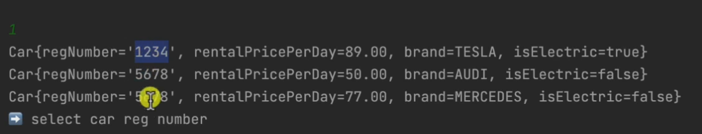
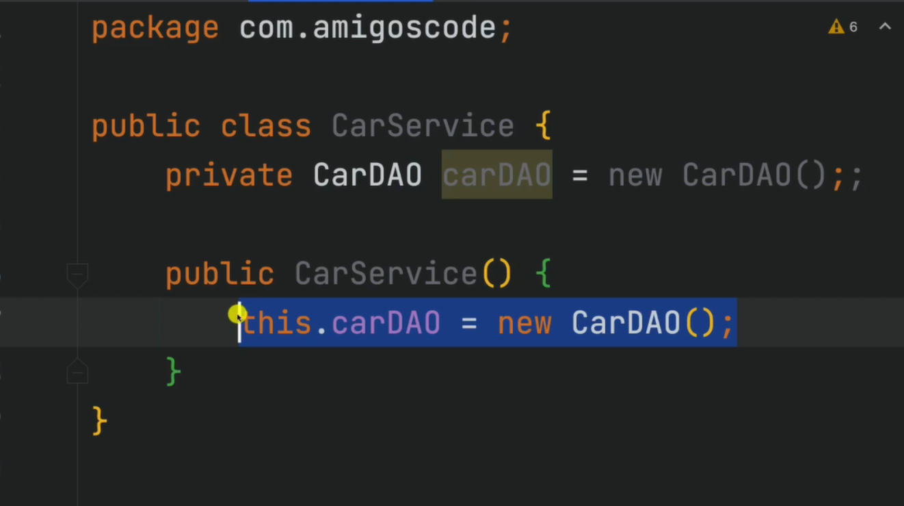
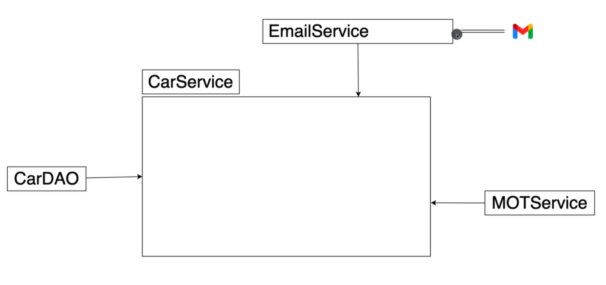

# Java_Master_Class_2023-1
- [Java\_Master\_Class\_2023-1](#java_master_class_2023-1)
  - [what is java ✅](#what-is-java-)
  - [what can u build with java ✅](#what-can-u-build-with-java-)
  - [Backend and Who use JAVA ✅](#backend-and-who-use-java-)
  - [java is not javascript ✅](#java-is-not-javascript-)
    - [compiler ✅](#compiler-)
    - [interpreter ✅](#interpreter-)
    - [comparison ✅](#comparison-)
  - [Static vs Dynamic type checking ✅](#static-vs-dynamic-type-checking-)
  - [java history ✅](#java-history-)
  - [Create Project - Part 1 ✅](#create-project---part-1-)
  - [Compiling and Running via Terminal ✅](#compiling-and-running-via-terminal-)
  - [View ByteCode ✅](#view-bytecode-)
  - [Public Static Void Main ✅](#public-static-void-main-)
  - [Reserved Keywords ✅](#reserved-keywords-)
  - [Comments ✅](#comments-)
  - [Variables ✅](#variables-)
  - [Primitives Data Types Difference ✅](#primitives-data-types-difference-)
  - [Numeric Literals with Underscore ✅](#numeric-literals-with-underscore-)
  - [Arithmetic Operators ✅](#arithmetic-operators-)
  - [Increment and Decrement Operators ✅](#increment-and-decrement-operators-)
  - [Comparison Operators ✅](#comparison-operators-)
  - [Short hand re-assignment ✅](#short-hand-re-assignment-)
  - [Naming Variables ✅](#naming-variables-)
  - [Strings ✅](#strings-)
  - [String API Documentation ✅](#string-api-documentation-)
  - [Reference Types and Objects ✅](#reference-types-and-objects-)
  - [Reference Types and Objects Diferences ✅](#reference-types-and-objects-diferences-)
  - [Pass py value with Primitives ✅](#pass-py-value-with-primitives-)
  - [Pass py value with Reference Types ✅](#pass-py-value-with-reference-types-)
  - [Arrays ✅](#arrays-)
  - [0 and Null Values for Arrays ✅](#0-and-null-values-for-arrays-)
  - [For Loop ✅](#for-loop-)
  - [Loops and Arrays ✅](#loops-and-arrays-)
  - [Enhanced For Loop ✅](#enhanced-for-loop-)
  - [For i vs Enhanced For Loop ✅](#for-i-vs-enhanced-for-loop-)
  - [While Loop ✅](#while-loop-)
  - [Do While  ✅](#do-while--)
  - [If Statements ✅](#if-statements-)
  - [Else If ✅](#else-if-)
  - [AND Logical Operators ✅](#and-logical-operators-)
  - [OR Logical Operators ✅](#or-logical-operators-)
  - [Logical Operators Recap ✅](#logical-operators-recap-)
  - [! on ifs ✅](#-on-ifs-)
  - [Dont do this with if statements ✅](#dont-do-this-with-if-statements-)
  - [Switch Statement ✅](#switch-statement-)
  - [Data Types for Enums ✅](#data-types-for-enums-)
  - [New Switch Expression ✅](#new-switch-expression-)
  - [Packages ✅](#packages-)
  - [Creating Packages ✅](#creating-packages-)
  - [Exploring Packages ✅](#exploring-packages-)
  - [Import keyword ✅](#import-keyword-)
  - [Optimizing imports ✅](#optimizing-imports-)
  - [Import with fully qualified name ✅](#import-with-fully-qualified-name-)
  - [No Import for java lang  ✅](#no-import-for-java-lang--)
  - [Access Modifiers Intro ✅](#access-modifiers-intro-)
  - [Public Access Modifier ✅](#public-access-modifier-)
  - [Private ✅](#private-)
  - [Default ✅](#default-)
  - [Recap ✅](#recap-)
  - [When To Use Each Access Modifier ✅](#when-to-use-each-access-modifier-)
  - [Static Keyword ✅](#static-keyword-)
  - [Methods ✅](#methods-)
  - [Method that add 2 numbers ✅](#method-that-add-2-numbers-)
  - [Parameters and Arguments ✅](#parameters-and-arguments-)
  - [Void methods ✅](#void-methods-)
  - [Naming Convention ✅](#naming-convention-)
  - [Exercise ✅](#exercise-)
  - [Exercise Solution ✅](#exercise-solution-)
  - [Understanding public static void main ✅](#understanding-public-static-void-main-)
  - [Program Arguments ✅](#program-arguments-)
  - [Type Inference with Var ✅](#type-inference-with-var-)
  - [Break Keyword and Loops ✅](#break-keyword-and-loops-)
  - [Continue ✅](#continue-)
  - [Return Keyword and Void Methods ✅](#return-keyword-and-void-methods-)
  - [Final Keyword ✅](#final-keyword-)
  - [Enums ✅](#enums-)
  - [Enums Methods ✅](#enums-methods-)
  - [Implicit and Explicit Type Casting ✅](#implicit-and-explicit-type-casting-)
  - [Global and Local Variables ✅](#global-and-local-variables-)
  - [Wrapper Classes ✅](#wrapper-classes-)
  - [Working With Strings ✅](#working-with-strings-)
  - [How Strings are stored in memory ✅](#how-strings-are-stored-in-memory-)
  - [Strings are Immutable ✅](#strings-are-immutable-)
  - [String Literal vs String Object ✅](#string-literal-vs-string-object-)
  - [Comparing Strings with == ✅](#comparing-strings-with--)
  - [Comparing Strings with .equals ✅](#comparing-strings-with-equals-)
  - [Useful String static Methods ✅](#useful-string-static-methods-)
  - [LocalDateTime ✅](#localdatetime-)
  - [LocalDate and LocalTime ✅](#localdate-and-localtime-)
  - [Creating Specif Dates ✅](#creating-specif-dates-)
  - [ZoneIds ✅](#zoneids-)
  - [Other Date Classes ✅](#other-date-classes-)
  - [The Problem With double ✅](#the-problem-with-double-)
  - [BigDecimal ✅](#bigdecimal-)
  - [Exploring BigDecimal Methods ✅](#exploring-bigdecimal-methods-)
  - [Scanner ✅](#scanner-)
  - [NextInt and other data types ✅](#nextint-and-other-data-types-)
  - [Outro ✅](#outro-)
  - [What is an exception ✅](#what-is-an-exception-)
  - [Try Catch ✅](#try-catch-)
  - [Multiple Catch Blocks ✅](#multiple-catch-blocks-)
  - [Using Or Within Catch ✅](#using-or-within-catch-)
  - [The Exception Class ✅](#the-exception-class-)
  - [Finally Keyword ✅](#finally-keyword-)
  - [Exception Hierarchy ✅](#exception-hierarchy-)
  - [Uncheck Exceptions ✅](#uncheck-exceptions-)
  - [Checked Exceptions ✅](#checked-exceptions-)
  - [Throw and Throws ✅](#throw-and-throws-)
  - [Throwing Exceptions ✅](#throwing-exceptions-)
  - [When To Use Checked VS Unchecked Exceptions ✅](#when-to-use-checked-vs-unchecked-exceptions-)
  - [Creating Custom Exceptions ✅](#creating-custom-exceptions-)
  - [Creating Files ✅](#creating-files-)
  - [Writing To Files ✅](#writing-to-files-)
  - [Reading from Files ✅](#reading-from-files-)
  - [Try with Resources ✅](#try-with-resources-)
  - [Your first class ✅](#your-first-class-)
  - [Setters ✅](#setters-)
  - [Getters ✅](#getters-)
  - [Constructors ✅](#constructors-)
  - [Default Constructors ✅](#default-constructors-)
  - [Multiple Constructors ✅](#multiple-constructors-)
  - [ToString ✅](#tostring-)
  - [The Inside Constructors ✅](#the-inside-constructors-)
  - [The This Keyword ✅](#the-this-keyword-)
  - [Everything in Java is an Object ✅](#everything-in-java-is-an-object-)
  - [@Override ✅](#override-)
  - [Comparing Objects with == ✅](#comparing-objects-with--)
  - [Comparing Obects with .equals ✅](#comparing-obects-with-equals-)
  - [Generating Equals method ✅](#generating-equals-method-)
  - [Equals Explained ✅](#equals-explained-)
  - [Generating Code ✅](#generating-code-)
  - [Person and Cats Example ✅](#person-and-cats-example-)
  - [POJOS ✅](#pojos-)
  - [Java Bean ✅](#java-bean-)
  - [Exercise ✅](#exercise--1)
  - [Exercise Solution ✅](#exercise-solution--1)
  - [Static Keyword ✅](#static-keyword--1)
  - [When to use Static ✅](#when-to-use-static-)
  - [Static Initlaization Block ✅](#static-initlaization-block-)
  - [Instance Block Initializer ✅](#instance-block-initializer-)
  - [Static Import  ✅](#static-import--)
  - [Packages ✅](#packages--1)
  - [Models ✅](#models-)
  - [Service Classes ✅](#service-classes-)
  - [Data Access Object ✅](#data-access-object-)
  - [Connecting DAO and Service ✅](#connecting-dao-and-service-)
  - [N Tier Architecture ✅](#n-tier-architecture-)
  - [Utitlity Classes ✅](#utitlity-classes-)
  - [The first CLI project task 🔲](#the-first-cli-project-task-)
  - [Demo  ✅](#demo--)
  - [Upcoming Section Intro ✅](#upcoming-section-intro-)
  - [Encapsulation ✅](#encapsulation-)
  - [Encapsulation in Action 🔲](#encapsulation-in-action-)
  - [The Problem With Non Private Fields 🔲](#the-problem-with-non-private-fields-)
  - [Data Hiding 🔲](#data-hiding-)
  - [String Class Encapsulation Example  🔲](#string-class-encapsulation-example--)
  - [What is Inheritance 🔲](#what-is-inheritance-)
  - [Implementing Inheritance 🔲](#implementing-inheritance-)
  - [Create an instance of Programmer 🔲](#create-an-instance-of-programmer-)
  - [Super Keyword 🔲](#super-keyword-)
  - [Protected Access Modifier 🔲](#protected-access-modifier-)
  - [Override 🔲](#override--1)
  - [Single and Multi Level Inheritance 🔲](#single-and-multi-level-inheritance-)
  - [Abstract Keyword on Classes 🔲](#abstract-keyword-on-classes-)
  - [Abstract Methods 🔲](#abstract-methods-)
  - [A Quick Word Before we move on 🔲](#a-quick-word-before-we-move-on-)
  - [Abstract Classes Example  🔲](#abstract-classes-example--)
  - [What is Polymorphism 🔲](#what-is-polymorphism-)
  - [Car Bicycle Electric Scooter Example 🔲](#car-bicycle-electric-scooter-example-)
  - [Create Your First Interface 🔲](#create-your-first-interface-)
  - [Implementing Interfaces 🔲](#implementing-interfaces-)
  - [Putting it all together 🔲](#putting-it-all-together-)
  - [Constants 🔲](#constants-)
  - [Default Methods 🔲](#default-methods-)
  - [CLI Project Exercise  🔲](#cli-project-exercise--)
  - [Don't Do This 🔲](#dont-do-this-)
  - [Dependecy Injection 🔲](#dependecy-injection-)
  - [Dependency Injection In Action 🔲](#dependency-injection-in-action-)
  - [Singletons and @Inject\_@Autowire 🔲](#singletons-and-inject_autowire-)
  - [CLI Project Exercise  🔲](#cli-project-exercise---1)
  - [SOLID Principles 🔲](#solid-principles-)
  - [Single Responsibitiy 🔲](#single-responsibitiy-)
  - [Open Close 🔲](#open-close-)
  - [Liskov 🔲](#liskov-)
  - [Interface Segragation 🔲](#interface-segragation-)
  - [Dependecy Inversion  🔲](#dependecy-inversion--)
  - [Null Pointer Exception 🔲](#null-pointer-exception-)
  - [The Wrong Way Of Dealing with Null 🔲](#the-wrong-way-of-dealing-with-null-)
  - [Optionals  🔲](#optionals--)
  - [Intro 🔲](#intro-)
  - [Overview 🔲](#overview-)
  - [Arrays 🔲](#arrays--1)
  - [Working With Arrays 🔲](#working-with-arrays-)
  - [2D Arrays 🔲](#2d-arrays-)
  - [Working with 2D Arrays 🔲](#working-with-2d-arrays-)
  - [Lists 🔲](#lists-)
  - [Working With Lists and ArrayList 🔲](#working-with-lists-and-arraylist-)
  - [Stack 🔲](#stack-)
  - [Working With Stacks 🔲](#working-with-stacks-)
  - [Queue 🔲](#queue-)
  - [Working With Queues 🔲](#working-with-queues-)
  - [Linked List 🔲](#linked-list-)
  - [Working with LinkedList 🔲](#working-with-linkedlist-)
  - [Sets 🔲](#sets-)
  - [Working with Sets 🔲](#working-with-sets-)
  - [Map Interface Hierarchy 🔲](#map-interface-hierarchy-)
  - [Maps 🔲](#maps-)
  - [Working With Maps 🔲](#working-with-maps-)
  - [HashCode 🔲](#hashcode-)
  - [Working HashCode and HashFunction 🔲](#working-hashcode-and-hashfunction-)
  - [Outro 🔲](#outro--1)
  - [HackerRank Big Notation 🔲](#hackerrank-big-notation-)
  - [CLI Project Exercise  🔲](#cli-project-exercise---2)
  - [Intro 🔲](#intro--1)
  - [Class Cast Exception 🔲](#class-cast-exception-)
  - [ClassCastException Example 2 🔲](#classcastexception-example-2-)
  - [Type Parameter and Type Argument 🔲](#type-parameter-and-type-argument-)
  - [Generic Type Naming Convention 🔲](#generic-type-naming-convention-)
  - [Generic and Classes 🔲](#generic-and-classes-)
  - [Generic and Classes Part 2 🔲](#generic-and-classes-part-2-)
  - [Generics and Methods 🔲](#generics-and-methods-)
  - [Bounded Type Parameters 🔲](#bounded-type-parameters-)
  - [Multiple Bounds 🔲](#multiple-bounds-)
  - [Unbounded Wildcard 🔲](#unbounded-wildcard-)
  - [Upper Bounded Wildcards 🔲](#upper-bounded-wildcards-)
  - [Lower Bounded Wildcards 🔲](#lower-bounded-wildcards-)
  - [Difference Between Bounded Type Parameters and Wildcards 🔲](#difference-between-bounded-type-parameters-and-wildcards-)
  - [Type Erasure 🔲](#type-erasure-)
  - [Outro  🔲](#outro--)
  - [Intro 🔲](#intro--2)
  - [Java Streams 🔲](#java-streams-)
  - [How Streams Work 🔲](#how-streams-work-)
  - [Getting Started With Streams 🔲](#getting-started-with-streams-)
  - [Exercise 🔲](#exercise--2)
  - [Declarative Solution 🔲](#declarative-solution-)
  - [Imperative Solution 🔲](#imperative-solution-)
  - [Visualise Streams 🔲](#visualise-streams-)
  - [Outro 🔲](#outro--2)
  - [CLI Exercise 🔲](#cli-exercise-)
  - [Maven 🔲](#maven-)
  - [Installing Maven 🔲](#installing-maven-)
  - [Verifying Maven Installation 🔲](#verifying-maven-installation-)
  - [Creating a Maven Project 🔲](#creating-a-maven-project-)
  - [Maven Folder Structure 🔲](#maven-folder-structure-)
  - [Project Object Model (pom.xml) 🔲](#project-object-model-pomxml-)
  - [Target Folder 🔲](#target-folder-)
  - [Installing Maven Dependencies 🔲](#installing-maven-dependencies-)
  - [Using Java Faker 🔲](#using-java-faker-)
  - [.m2 Folder 🔲](#m2-folder-)
  - [Maven Lifecycles 🔲](#maven-lifecycles-)
  - [Running Maven Commands 🔲](#running-maven-commands-)
  - [Packaging and Jar Files 🔲](#packaging-and-jar-files-)
  - [CLI Project Exercise  🔲](#cli-project-exercise---3)
  - [Intro 🔲](#intro--3)
  - [JUnit 🔲](#junit-)
  - [Installing JUNIT 🔲](#installing-junit-)
  - [Launching Your First Test 🔲](#launching-your-first-test-)
  - [Calculator and CalculatorTest Classes 🔲](#calculator-and-calculatortest-classes-)
  - [Writing Your First Unit Test 🔲](#writing-your-first-unit-test-)
  - [Assertions 🔲](#assertions-)
  - [Test Scenarios 🔲](#test-scenarios-)
  - [Other JUnit Features 🔲](#other-junit-features-)
  - [CLI Exercise  🔲](#cli-exercise--)
  - [Section Intro 🔲](#section-intro-)
  - [Intro Spring Boot 🔲](#intro-spring-boot-)
  - [Spring Initializr 🔲](#spring-initializr-)
  - [Open the project with IntelliJ 🔲](#open-the-project-with-intellij-)
  - [The pom.xml 🔲](#the-pomxml-)
  - [Cleanup Few Things  🔲](#cleanup-few-things--)
  - [JDK 🔲](#jdk-)
  - [Your first Spring Boot Application 🔲](#your-first-spring-boot-application-)
  - [Embedded Web Serve 🔲](#embedded-web-serve-)
  - [Configuring Embedded Web Server 🔲](#configuring-embedded-web-server-)
  - [Your first API 🔲](#your-first-api-)
  - [@SpringBootApplication 🔲](#springbootapplication-)
  - [Spring Web MVC 🔲](#spring-web-mvc-)
  - [JSON For Java 🔲](#json-for-java-)
  - [Java Objects to JSON Objects  🔲](#java-objects-to-json-objects--)
  - [Introduction to HTTP 🔲](#introduction-to-http-)
  - [The Evolution of HTTP 🔲](#the-evolution-of-http-)
  - [HTTP Request and Response Messages 🔲](#http-request-and-response-messages-)
  - [HTTP Methods 🔲](#http-methods-)
  - [HTTP Status Codes 🔲](#http-status-codes-)
  - [URL 🔲](#url-)
  - [API and REST API 🔲](#api-and-rest-api-)
  - [Public APIs and Other Types 🔲](#public-apis-and-other-types-)
  - [Why build APIs 🔲](#why-build-apis-)
  - [Chrome Developer Tools 🔲](#chrome-developer-tools-)
  - [Exploring XHR for our API 🔲](#exploring-xhr-for-our-api-)
  - [Inspecting Instagram Network Activity 🔲](#inspecting-instagram-network-activity-)
  - [REST Client \& Postman 🔲](#rest-client--postman-)
  - [IntelliJ REST Clients 🔲](#intellij-rest-clients-)
  - [CRUD and Section Overview 🔲](#crud-and-section-overview-)
  - [Customer Model 🔲](#customer-model-)
  - [Fake Database 🔲](#fake-database-)
  - [API Endpoint 🔲](#api-endpoint-)
  - [@PathVariable 🔲](#pathvariable-)
  - [N Tier Architecture 🔲](#n-tier-architecture--1)
  - [Refactor - Controller Service and DAO 🔲](#refactor---controller-service-and-dao-)
  - [@RestController @Service @Repository @Component 🔲](#restcontroller-service-repository-component-)
  - [Application Context 🔲](#application-context-)
  - [Inspecting beans 🔲](#inspecting-beans-)
  - [Bean Scopes 🔲](#bean-scopes-)
  - [Creating Beans 🔲](#creating-beans-)
  - [We are not handling error the right way 🔲](#we-are-not-handling-error-the-right-way-)
  - [Custom Exception 🔲](#custom-exception-)
  - [@ResponseStatus 🔲](#responsestatus-)
  - [Include error Message to Responses 🔲](#include-error-message-to-responses-)
  - [Section Intro 🔲](#section-intro--1)
  - [Postgres and Docker 🔲](#postgres-and-docker-)
  - [Verifying Docker Installation 🔲](#verifying-docker-installation-)
  - [Postgres DB with Docker compose 🔲](#postgres-db-with-docker-compose-)
  - [Connecting to Database 🔲](#connecting-to-database-)
  - [Connecting to DB using IntelliJ IDEA 🔲](#connecting-to-db-using-intellij-idea-)
  - [Data Source \& JPA 🔲](#data-source--jpa-)
  - [Installing PostgreSQL Driver and Spring Data JPA Dependencies 🔲](#installing-postgresql-driver-and-spring-data-jpa-dependencies-)
  - [Configuring Datasource Properties 🔲](#configuring-datasource-properties-)
  - [Create Customer Table 🔲](#create-customer-table-)
  - [Entity 🔲](#entity-)
  - [Inspecting The Database 🔲](#inspecting-the-database-)
  - [Column Contraints 🔲](#column-contraints-)
  - [CustomerRepository 🔲](#customerrepository-)
  - [CustomerJPADataAccessService class 🔲](#customerjpadataaccessservice-class-)
  - [@Qualifier 🔲](#qualifier-)
  - [Saving Entities 🔲](#saving-entities-)
  - [Exploring JPA Methods 🔲](#exploring-jpa-methods-)
  - [The Problem 🔲](#the-problem-)
  - [Exercise Solution  🔲](#exercise-solution--)
  - [Intro 🔲](#intro--4)
  - [Chasing Interface 🔲](#chasing-interface-)
  - [Override insert customer 🔲](#override-insert-customer-)
  - [Business Logic for Adding new Customer 🔲](#business-logic-for-adding-new-customer-)
  - [Controller @RequestMapping and @RequestBody 🔲](#controller-requestmapping-and-requestbody-)
  - [Testing POST Request 🔲](#testing-post-request-)
  - [Exercise 🔲](#exercise--3)
  - [Exercise Solution 🔲](#exercise-solution--2)
  - [Exercise 🔲](#exercise--4)
  - [Exercise Solution 🔲](#exercise-solution--3)

## what is java ✅


## what can u build with java ✅


## Backend and Who use JAVA ✅


## java is not javascript ✅


### compiler ✅


### interpreter ✅


### comparison ✅


## Static vs Dynamic type checking ✅


## java history ✅


## Create Project - Part 1 ✅
```java
package com.chamara;

public class Main {
    public static void main(String[] args) {
        System.out.println("Hello world!");
    }
}
```
## Compiling and Running via Terminal ✅
```shell
java Main.java
```

## View ByteCode ✅

```java
package com.chamara;

public class Main {
    public static void main(String[] args) {

        System.out.println("Hello world!");

    }
}
```
java virtual machine can understand this code
```bytecode
// class version 65.0 (65)
// access flags 0x21
public class com/chamara/Main {

  // compiled from: Main.java

  // access flags 0x1
  public <init>()V
   L0
    LINENUMBER 3 L0
    ALOAD 0
    INVOKESPECIAL java/lang/Object.<init> ()V
    RETURN
   L1
    LOCALVARIABLE this Lcom/chamara/Main; L0 L1 0
    MAXSTACK = 1
    MAXLOCALS = 1

  // access flags 0x9
  public static main([Ljava/lang/String;)V
   L0
    LINENUMBER 6 L0
    GETSTATIC java/lang/System.out : Ljava/io/PrintStream;
    LDC "Hello world!"
    INVOKEVIRTUAL java/io/PrintStream.println (Ljava/lang/String;)V
   L1
    LINENUMBER 8 L1
    RETURN
   L2
    LOCALVARIABLE args [Ljava/lang/String; L0 L2 0
    MAXSTACK = 2
    MAXLOCALS = 1
}

```
## Public Static Void Main ✅
```java
package com.chamara;

public class Main {
//    this is the entry point of the program
    public static void main(String[] args) {

        System.out.println("Hello world!");

    }
}
```

## Reserved Keywords ✅
reserved keywords are words that are already used by java
 
```java
abstract	continue	for	new	switch
assert***	default	goto*	package	synchronized
boolean	do	if	private	this
break	double	implements	protected	throw
byte	else	import	public	throws
case	enum****	instanceof	return	transient
catch	extends	int	short	try
char	final	interface	static	void
class	finally	long	strictfp**	volatile
const*	float	native	super	while
```
## Comments ✅

```java
//    this is a single line comment
/*
this is a multi line comment
 */

```
## Variables ✅

```java
// primitive data types
// byte, short, int, long, float, double, char, boolean

// byte
byte age = 30;
// short
short viewsCount = 12345;
// int
int viewsCount = 123456789;
// long
long viewsCount = 123456789123456789L;
// float
float price = 10.99F;
// double
double price = 10.99;
// char
char letter = 'A';
// boolean
boolean isEligible = true;
```
## Primitives Data Types Difference ✅


## Numeric Literals with Underscore ✅
this number is easy to read
```java
int viewsCount = 123_456_789;
```
## Arithmetic Operators ✅

```java
int number1 = 10;
int number2 = 3;

// addition
int sum = number1 + number2;
// subtraction
int sub = number1 - number2;
// multiplication
int mul = number1 * number2;
// division
int div = number1 / number2;
// modulus
int mod = number1 % number2;

// order of operations
int x = 10 + 3 * 2;
// order of operations with parenthesis
int y = (10 + 3) * 2;
```
// BODMAS
- B-Brackets
- O-Orders(powers and square roots, etc.)
- D-Division
- M-Multiplication
- A-Addition
- S-Subtraction


## Increment and Decrement Operators ✅

```java
// increment
number1++;
++number1;
// decrement
number1--;
--number1;
```
## Comparison Operators ✅

```java
// comparison operators
// equal to ==
// not equal to !=
// greater than >
// greater than or equal to >=
// less than <
// less than or equal to <=
// example


```
## Short hand re-assignment ✅

```java
int number = 10;
// this is equal to result = result+ number + 5;
int result += number + 5;
```


## Naming Variables ✅

```java
int goodNumber = 10;
// this is not a good variable name
// camel case
// start with lower case and then capitalize the first letter of each word
int BandNumber = 10;
// boolean variables should start with is
boolean isGood = true;
```
## Strings ✅
 String is a reference type
```java
String message = "Hello World";
// concatenation
String message = "Hello" + "World";
```
## String API Documentation ✅

api doc https://docs.oracle.com/en/java/javase/21/docs/api/java.base/java/lang/String.html
## Reference Types and Objects ✅

```java
package com.chamara;

import java.awt.*;

public class Main {
//    this is the entry point of the program
    public static void main(String[] args) {

       int age = 30;
        Point point1 = new Point(10, 10 );
        System.out.println("point1 = " + point1);

    }
} 
```
## Reference Types and Objects Diferences ✅


## Pass py value with Primitives ✅
 
```java
int a = 10;
int b = a;
a = 100;
System.out.println("a = " + a); 
// a = 100
// b = 10

```


## Pass py value with Reference Types ✅


## Arrays ✅

```java
package com.chamara;

import java.util.Arrays;

public class Main {
    
    public static void main(String[] args) {

        int[] array = {1, 2, 3, 4, 5};
        System.out.println(array[2]);
        int[] array2 = new int[5];
        array2[0] = 1;
        array2[1] = 2;
        array2[2] = 3;
        array2[3] = 4;
        array2[4] = 5;
        System.out.println(array2[2]);
        System.out.println(Arrays.toString(array2));

    }
}
```
## 0 and Null Values for Arrays ✅

```java
package com.chamara;

import java.util.Arrays;

public class Main {

    public static void main(String[] args) {
//    primitive data types
        int[] array2 = new int[5];
        Arrays.fill(array2, 8);
        array2[0] = 1;
        System.out.println(Arrays.toString(array2));

        boolean[] array1 = new boolean[5];
        System.out.println(Arrays.toString(array1));
//        output [false, false, false, false, false]

        char[] array = new char[5];
        System.out.println(Arrays.toString(array));
//        output [ ,  ,  ,  ,  ]

        byte[] array3 = new byte[5];
        System.out.println(Arrays.toString(array3));
//            output [0, 0, 0, 0, 0]

        short[] array4 = new short[5];
        System.out.println(Arrays.toString(array4));
//            output [0, 0, 0, 0, 0]

        long[] array5 = new long[5];
        System.out.println(Arrays.toString(array5));
//            output [0, 0, 0, 0, 0]

        float[] array6 = new float[5];
        System.out.println(Arrays.toString(array6));
//            output [0.0, 0.0, 0.0, 0.0, 0.0]

        double[] array7 = new double[5];
        System.out.println(Arrays.toString(array7));
//            output [0.0, 0.0, 0.0, 0.0, 0.0]


//        Objects
        String[] array8 = new String[3];
//        Arrays.fill(array3, "Hello");
        System.out.println(Arrays.toString(array8));
// [null, null, null, null, null]
    }
}
```


## For Loop ✅

```java
package com.chamara;

public class Main {

    public static void main(String[] args) {
        for (int i = 0; i < 5; i++) {
            System.out.println("Hello World");
        }
    }
}

// 
```
## Loops and Arrays ✅

```java
package com.chamara;

public class Main {

    public static void main(String[] args) {
        String[] names = {"Chamara", "Kasun", "Nimal", "Kamal", "Sunil"};

        for (int i = 0; i < names.length; i++) {
            System.out.println(names[i]);
        }
    }
}
```
## Enhanced For Loop ✅

```java
package com.chamara;

public class Main {

    public static void main(String[] args) {
        String[] names = {"Chamara", "Kasun", "Nimal", "Kamal", "Sunil"};

        for (String name : names) {
            System.out.println(name);
        }
    }
}
```
## For i vs Enhanced For Loop ✅

```java
//  we use old for loop when we need access to the index
```
## While Loop ✅

```java
package com.chamara;

public class Main {

    public static void main(String[] args) {
        int x = 12;
        while (x < 100) {
            System.out.println(x);
            x += 10;
        }
    }
}
```
## Do While  ✅

```java
package com.chamara;

public class Main {

    public static void main(String[] args) {
        int x = 120;
        do {
            System.out.println(x);
            x += 10;
        } while (x < 100);
    }
}
```
## If Statements ✅

```java
package com.chamara;

public class Main {

    public static void main(String[] args) {
        if (args.length == 0) {
            System.out.println("Please enter a number");
        }
    }
}
```

## Else If ✅

```java
package com.chamara;

import java.util.Arrays;

public class Main {

    public static void main(String[] args) {
        if (args.length == 0) {
            System.out.println("Please enter a number");
        } else if (args.length != 1) {
            System.out.println("args = " + Arrays.toString(args));
        }
    }
}
```
## AND Logical Operators ✅

```java
// &&
if(a && b){
    // ....
}
```
## OR Logical Operators ✅

```java
if(a || b){
    // ....
}
```
## Logical Operators Recap ✅

```java
sout.println("a && b = " + (a && b));
sout.println("a || b = " + (a || b));
sout.println("!(a && b) = " + !(a && b));

```
## ! on ifs ✅

```java
if(!true){
    // .... 
}
```
## Dont do this with if statements ✅

```java
if(condition==true){
    // ...
}
```
## Switch Statement ✅

```java
package com.chamara;

public class Main {

    public static void main(String[] args) {
//        switch example
        char grade = 'A';
// grade can only be byte, short, int, char, String
//  or Byte, Short, Integer, Character, String, or an enum
        switch (grade) {
            case 'A':
                System.out.println("Excellent!");
                break;
            case 'B':
            case 'C':
                System.out.println("Well done");
                break;
            case 'D':
                System.out.println("You passed");
                break;
            case 'F':
                System.out.println("Better try again");
                break;
            default:
                System.out.println("Invalid grade");
        }

    }
}
```

## Data Types for Enums ✅

```java
//  or Byte, Short, Integer, Character, String, or an enum
```
## New Switch Expression ✅

```java
```java
package com.chamara;

public class Main {

    public static void main(String[] args) {
//        switch example
        char grade = 'A';
// grade can only be byte, short, int, char, String
//  or Byte, Short, Integer, Character, String, or an enum
        String result = switch (grade) {
            case 'A' -> System.out.println("Excellent!");
            case 'B', 'C' -> System.out.println("Well done");
            case 'D' -> System.out.println("You passed");
            case 'F' -> System.out.println("Better try again");
            default -> System.out.println("Invalid grade");
        }

    }
}
```

## Packages ✅
packages in java is nothing but folders that allows you to store your files.


```java
package com.chamara;

public class Main {

    public static void main(String[] args) {
        
    }

}
```
this help us to organize our code.
## Creating Packages ✅
- package name should be in lower case
- should be in the src folder.
- always should have a root package like com.chamara
- [organization].[domain]


```java
package com.chamara.email;

public class EmailValidator {
}

```
## Exploring Packages ✅


## Import keyword ✅
how to use other packages in our package
```java
package com.chamara;
// * means import all classes in the package

import java.awt.*;

public class Main {
    
    public static void main(String[] args) {
        Point point1 = new Point(1, 1);

    }

}
```


* means everything under awt

## Optimizing imports ✅

```java
package com.chamara;
// * means import all classes in the package

import java.awt.Color;
import java.awt.Point;
import java.util.Arrays;

public class Main {

    public static void main(String[] args) {
        
    }

}
```


## Import with fully qualified name ✅


when there is a conflict between two classes we can use fully qualified name

```java
package com.chamara;

import java.util.Date;

public class Main {

    public static void main(String[] args) {
        Date date = new Date();
        java.sql.Date sqlDate = new java.sql.Date(0);
    }

}
```
## No Import for java lang  ✅

```java
package com.chamara;

public class Main {

    public static void main(String[] args) {
//        there is no import statement why ?
//        any package within the lang package is no need to imported
//        lang package is the default package in java
        String name = "Chamara";
        double pi = Math.PI;
    }

}
```
## Access Modifiers Intro ✅

```java
package com.chamara;

public class Main {

    public static void main(String[] args) {
//    Access Modifiers - Access modifiers are keywords that
//    set the accessibility of classes, methods, and other members.
//    There are four access modifiers:
//    public - The code is accessible for all classes
//    private - The code is only accessible within the declared class
//    protected - The code is accessible in the same package
//    and subclasses
//    default - The code is only accessible in the same package

    }

}
```
## Public Access Modifier ✅


public means accessible to all classes

access modifiers are only for 
- classes
- methods
- attributes
- constructors


this is giving an error because we can't have a access modifier for a local variable


folder structure


```java
package com.chamara;

public class Main {
    public static String name = "Chamara";

    public static void main(String[] args) {
//        this is a local variable to the main method
//        if I try to make this public it will give an error
        String name = "Chamara";
    }

}
```
```java
package com.chamara.email;

import com.chamara.Main;

public class EmailValidator {
    public static void main(String[] args) {
        String name = Main.name;
        System.out.println(name);
        Main.main(args);

    }
}

```

output


## Private ✅

```java
package com.chamara;

public class Main {
    private static String name = "Chamara";

    public static void main(String[] args) {
//        this is a local variable to the main method
//        if I try to make this public it will give an error
        System.out.println(name);
    }

}
```
now we can't access this variable from another class


## Default ✅


in a different package we can't access this variable


```java
package com.chamara;

public class Main {
    static String name = "Chamara";

    public static void main(String[] args) {
//        this is a local variable to the main method
//        if I try to make this public it will give an error
        System.out.println(name);
    }

}
```
this works because we are in the same package
```java
package com.chamara;

public class Foo {
    public static void main(String[] args) {
        Main.name
    }
}

```

this doesn't work because we are in a different package
```java
package com.chamara.email;

import com.chamara.Main;

public class EmailValidator {
    public static void main(String[] args) {
        Main.main(args);
        Main.name
    }
}
```

## Recap ✅


## When To Use Each Access Modifier ✅

```java

```
## Static Keyword ✅

static means it belongs to the class not to the object/instance
we can't use non static variables inside a static context


you can fix it by 


```java
package com.chamara;

public class Main {
    public static String name = "Chamara";
    String brand = "CBRAND";

    public static void main(String[] args) {
//        this is a local variable to the main method
//        if I try to make this public it will give an error
        System.out.println(name);
        Main main = new Main();
        System.out.println(main.brand);
    }

}
```
## Methods ✅

```java
package com.chamara;

public class Main {
    public static String name = "Chamara";

    //    this is a method
    /*
     * when we create a method
     * first we have to define the access modifier -> public
     * optional -> static
     * then we have to define the return type -> void
     * then we have to define the method name -> main
     * then we have to define the parameters -> String[] args
     * then we have to define the method body -> {}
     * */
    public static void main(String[] args) {
//        body
    }

}
```
## Method that add 2 numbers ✅

```java
package com.chamara;

public class Main {
    public static String name = "Chamara";

    public static void main(String[] args) {
        int response = add(12, 34);
        System.out.println(response);
    }

    private static int add(int a, int b) {
        return a + b;
    }

}
```
## Parameters and Arguments ✅

```java
// parameter
private static int add(int a, int b) {
        return a + b;
    }

// arguments
add(12, 34)
```
## Void methods ✅

```java
package com.chamara;

public class Main {
    public static String name = "Chamara";

    public static void main(String[] args) {
        printName();
    }

    private static void printName() {
        System.out.println(name);
    }
}
```
## Naming Convention ✅


## Exercise ✅


## Exercise Solution ✅

```java
package com.chamara;

public class Main {
    public static String name = "Chamara";

    public static void main(String[] args) {
        System.out.println(rentelYield(40000, 100_000_000));

    }

    public static double rentelYield(double rentel, double cost) {
        double annualIncome = rentel * 12;
        double yield = annualIncome / cost;
        return yield / 100;
    }
}
```
## Understanding public static void main ✅

```java
package com.chamara;

import java.util.Arrays;

public class Main {
    public static String name = "Chamara";

    public static void main(String[] args) {

        if (args.length > 0) {
            System.out.println(Arrays.toString(args));
        } else {
            System.out.println("No arguments");
        }

    }
}
```


- public means accessible to all classes
- static means it belongs to the class not to the object/instance
- void means it doesn't return anything
- main is the method name,main is a special method name in java.jvm uses this method to start the program
- String[] args is the parameter
- {} is the method body


## Program Arguments ✅


## Type Inference with Var ✅

```java
package com.chamara;

public class Main {
    public static String name = "Chamara";

    public static void main(String[] args) {
//        cannot use var in class level
//        var name = "Chamara";
//        this is not allowed
//        Type inference with var
        var name = "Chamara";
        var names = new String[]{"Chamara", "Kasun", "Nimal", "Kamal"};
        var age = 25;
        var isAdult = false;
        var balance = 1_000_000.33;

    }

    //    this is not allowed
//    public static void printName(var name) {
//        System.out.println(name);
//    }
}
```

## Break Keyword and Loops ✅
this works with for, while, do while, switch
```java
package com.chamara;

public class Main {
    public static void main(String[] args) {
        var numebrs = new int[]{1, 2, 3, 4, 5};

        for (var number : numebrs) {
            if (number == 3) {
                break;
            }
            System.out.println(number);
        }
    }
}
```
## Continue ✅

```java
package com.chamara;

public class Main {
    public static void main(String[] args) {
        var names = new String[]{
                "Chamara",
                "Kasun",
                "Kamal",
                "Nimal",
                "Sunil"
        };
        for (var name : names) {

            if (name.startsWith("K")) {
                continue;
            }
            System.out.println(name);
        }
    }
}
```
output
```shell
Chamara
Nimal
Sunil
```
## Return Keyword and Void Methods ✅

```java
package com.chamara;

public class Main {
    public static void main(String[] args) {
        var names = new String[]{
                "Chamara",
                "Kasun",
                "Kamal",
                "Nimal",
                "Sunil"
        };
        for (var name : names) {

            if (name.startsWith("K")) {
                return;
            }
            System.out.println(name);
        }
        System.out.println("End of the loop");
    }
}
```

output


```shell
Chamara
```

when we are using return keyword it will stop the execution of the method

so it will not print the last line

```java
System.out.println("End of the loop");
```

but if we use break keyword it will print the last line

```shell
Chamara
End of the loop
```


## Final Keyword ✅

final keyword is used to make a variable constant

when we use final keyword with a class we can't extend that class

when we use final keyword with a method we can't override that method

when to use final keyword in java

- when we want to make a variable constant

Once a final variable has been assigned, it always contains the same value. If a final variable holds a reference to an object, then the state of the object can be changed by operations on the object, but the variable will always refer to the same object. This applies to both instance variables and local variables.

```java
final int MAX_SIZE = 100;
```

- when we want to prevent inheritance

If you mark a class as final, it can't be subclassed. This is often done for security reasons, to prevent the class's behavior from being changed through subclassing, or for efficiency reasons, to allow the compiler to optimize method calls.

```java
public final class MyFinalClass {
    // class body
}
```
- when we want to prevent method overriding
  
You can declare a method as final. You cannot override a final method in a subclass. This is often done for security reasons with methods in the Java API.

```java
public final void showDetails() {
    // method body
}
```


we can do this


```java
package com.chamara;

import java.awt.*;

public class Main {
    //    create a constant
    public static final String NAME = "Chamara";

    public static void main(String[] args) {
//        final keyword
//        we use final keyword to make a variable constant
//        prevent inheritance
//        prevent method overriding
        final var name = "Chamara";
//        name = "Kevin";
        System.out.println(name);
        final Point p = new Point(1, 2);
        p.x = 2;
        p.y = 3;
        System.out.println(p);
    }
}
```
## Enums ✅

```java
package com.chamara;

public enum Gender {
    MALE,
    FEMALE

}

```
```java
package com.chamara;

public class Main {


    public static void main(String[] args) {
        System.out.println(Gender.MALE);
        System.out.println(GenderConstants.FEMALE);
        System.out.println(GenderConstants.MALE);
    }
}
```
## Enums Methods ✅

```java
package com.chamara;

import java.util.Arrays;

public class Main {


    public static void main(String[] args) {
        System.out.println(Gender.valueOf("FEMALE"));
        System.out.println(Arrays.toString(Gender.values()));
    }
}
```
## Implicit and Explicit Type Casting ✅

```java
package com.chamara;

public class Main {


    public static void main(String[] args) {
//        type casting - converting one type to another
//        Implicit type casting - done by the compiler(widening)
//        Explicit type casting - done by the programmer
        int balance = 100;
        System.out.println(balance);
        double newBalance = balance;
        System.out.println(newBalance);

//        Explicit type casting - done by the programmer(Narrowing)
        double newBalance2 = 100.5;
        System.out.println(newBalance2);
        int balance2 = (int) newBalance2;
        System.out.println(balance2);

    }
}
```
## Global and Local Variables ✅

```java
package com.chamara;

// local and global scope example
public class Main {
    final static public String name = "Chamara";
    final static private String BRAND = "Toyota";

    public static void main(String[] args) {
        var name = "Kasun";
        System.out.println(name);
        System.out.println(BRAND);
        Foo.test();
    }
}
```

```java
package com.chamara;

public class Foo {
    static void test() {
        System.out.println(Main.name);
    }
}

```

local variable has the highest priority.

```shell
Kasun
Toyota
Chamara
```

## Wrapper Classes ✅

```java
package com.chamara;

// local and global scope example
public class Main {
    public static void main(String[] args) {
//        Primitive data types wrapper classes
//        byte, short, int, long, float, double, boolean, char
//        Byte, Short, Integer, Long, Float, Double, Boolean, Character

        int a = 10;
        Integer b = 10;
        int x = b.intValue();
        System.out.println(x);
    }
}
```

Wrapper classes in Java are used for converting primitive data types into objects, and this process is called autoboxing. The reverse process is called unboxing. Here are some scenarios where you might use wrapper classes:

- Collections: 

Java collections can't handle primitive types, so you need to use wrapper classes when you want to add primitive types to collections.

```java
List<Integer> list = new ArrayList<>();
list.add(1); // Autoboxing from int to Integer
```

- Nullability

Primitive types can't be null in Java, but sometimes you may need to represent a missing value. In such cases, you can use wrapper classes, which can be set to null.


```java
Integer a = null;
```
- Class Methods
  
Wrapper classes have a number of useful methods for converting, comparing and performing other operations on the primitive data type they represent. For example, you can use the Integer.parseInt() method to convert a string to an integer.

```java
String numberStr = "123";
int number = Integer.parseInt(numberStr);
```

- Generics

Java's generics do not work with primitive types. So, if you are creating a generic class, method, or interface, and you want it to work with integers, you would need to use the Integer class rather than the int primitive type.


```java
public class MyGenericClass<T> {
    private T t;

    public void setValue(T t) {
        this.t = t;
    }

    public T getValue() {
        return t;
    }
}

MyGenericClass<Integer> intClass = new MyGenericClass<>();
intClass.setValue(10);
```

*Remember that while wrapper classes are very useful, they do have a higher memory footprint than primitive types, so use them judiciously.*


## Working With Strings ✅
documentation https://docs.oracle.com/en/java/javase/21/docs/api/java.base/java/lang/String.html
```java

```

```java
package com.chamara;

// local and global scope example
public class Main {
    public static void main(String[] args) {
//        Strings
        String name = " Chamara ";
        System.out.println(name.toLowerCase());
//        -> chamara
        System.out.println(name.toUpperCase());
//        -> CHAMARA
        System.out.println(name.trim());
//        -> Chamara
        System.out.println(name.replace("a", "A"));
//        -> ChAmArA
        System.out.println(name.replace("a", "A").trim());
//        -> ChAmArA
        System.out.println(name);
//        ->  Chamara
        System.out.println(" ".isBlank());
//        -> true
        System.out.println(" ".isEmpty());
//        -> false
        System.out.println(name.length());
//        -> 9
        System.out.println(name.charAt(0));
//        -> " "
        System.out.println(name.indexOf("a"));
//        -> 2
        System.out.println(name.lastIndexOf("a"));
//        -> 7
        System.out.println(name.substring(1));
//        -> Chamara
        System.out.println(name.substring(1, 4));
//        -> Cha
        System.out.println(name.contains("a"));
//        -> true
        System.out.println(name.startsWith(" "));
//        -> true
        System.out.println(name.endsWith(" "));
//        -> true
        System.out.println(name.equals(" Chamara "));
//        -> true
        System.out.println(name.equalsIgnoreCase(" chamara "));
//        -> true
        
    }
}
```
## How Strings are stored in memory ✅

documentation https://www.textbook.amigoscode.com/docs/java/strings#how-strings-are-stored

When a Java program is run, the Java Virtual Machine (JVM) loads the program into memory and creates an instance of the java.lang.String class to represent each string literal used in the program. Strings are immutable, which means that once they are created, they cannot be changed. When a string is concatenated with another string, a new string object is created that represents the concatenated strings. The java.lang.StringBuilder class can be used to modify strings more efficiently. Strings are stored in a contiguous area of memory, which means that they can be accessed quickly. However, this also means that strings take up more memory than other data types.


## Strings are Immutable ✅
Strings in java are immutable because they are constant. The value of a string cannot be changed once it is created. strings are also thread-safe, meaning that they can be safely used in concurrent programming without the risk of data corruption.

Immutability also makes strings more secure, because they cannot be modified by malicious code.

Finally, strings are more efficient when they are immutable, because the java virtual machine can optimize them better.


## String Literal vs String Object ✅

```java
package com.chamara;

// local and global scope example
public class Main {
    public static void main(String[] args) {
//        string literal
//        this is in the string pool
        String name = "Chamara";
//        this is in the heap
// this is bad practice
        String name2 = new String("Chamara");
    }
}
```
## Comparing Strings with == ✅

== compares the reference not the value

```java
package com.chamara;

// local and global scope example
public class Main {
    public static void main(String[] args) {
        String name1 = "Chamara";
        String name2 = "Chamara";
        String name3 = new String("Chamara");
//    bad way to compare strings
        System.out.println(name1 == name2);
        System.out.println(name1 == name3);
//        good way to compare strings
        System.out.println(name1.equals(name2));
        System.out.println(name1.equals(name3));
    }
}
// true
// false
// true
// true
```
## Comparing Strings with .equals ✅

```java
package com.chamara;

// local and global scope example
public class Main {
    public static void main(String[] args) {
        String name1 = "Chamara";
        String name2 = "Chamara";
        String name3 = new String("Chamara");
//    bad way to compare strings
        System.out.println(name1 == name2);
        System.out.println(name1 == name3);
//        good way to compare strings
        System.out.println(name1.equals(name2));
        System.out.println(name1.equals(name3));
    }
}
// true
// false
// true
// true
```
## Useful String static Methods ✅

```java
String name = String.join("-", "Chamara", "Kasun", "Nimal", "Kamal");
// Chamara-Kasun-Nimal-Kamal
```
## LocalDateTime ✅

```java
package com.chamara;

import java.time.LocalDateTime;

// local and global scope example
public class Main {
    public static void main(String[] args) {
        LocalDateTime now = LocalDateTime.now();
        System.out.println(now);
        System.out.println(now.getDayOfWeek());
        System.out.println(now.getMonth());
        System.out.println(now.getYear());
        System.out.println(now.getHour());
        System.out.println(now.getMinute());
        System.out.println(now.getSecond());

    }
}
```
```shell
2023-11-23T11:01:00.698168200
THURSDAY
NOVEMBER
2023
11
1
0
```
## LocalDate and LocalTime ✅


```java
package com.chamara;


import java.time.LocalDate;

// local and global scope example
public class Main {
    public static void main(String[] args) {
        LocalDate dateOfBirth = LocalDate.of(1995, 8, 22);
        System.out.println(dateOfBirth);
        System.out.println(dateOfBirth.getDayOfWeek());
        System.out.println(dateOfBirth.getDayOfYear());
        System.out.println(dateOfBirth.getMonth());
        System.out.println(dateOfBirth.getMonthValue());
        System.out.println(dateOfBirth.getYear());
        System.out.println(dateOfBirth.isLeapYear());
        System.out.println(dateOfBirth.lengthOfMonth());
        System.out.println(dateOfBirth.lengthOfYear());
        System.out.println(dateOfBirth.plusDays(1));
        System.out.println(dateOfBirth.plusMonths(1));
        System.out.println(dateOfBirth.plusYears(1));
        System.out.println(dateOfBirth.minusDays(1));
        System.out.println(dateOfBirth.minusMonths(1));
        System.out.println(dateOfBirth.minusYears(1));
        System.out.println(dateOfBirth.withDayOfMonth(1));
        System.out.println(dateOfBirth.withDayOfYear(1));
        System.out.println(dateOfBirth.withMonth(1));
        System.out.println(dateOfBirth.withYear(1));
        System.out.println(dateOfBirth.withYear(1996));
        System.out.println(dateOfBirth.withYear(1996).withMonth(1).withDayOfMonth(1));
        System.out.println(dateOfBirth.withYear(1996).withMonth(1).withDayOfMonth(1).getDayOfWeek());
        System.out.println(dateOfBirth.withYear(1996).withMonth(1).withDayOfMonth(1).getDayOfWeek().getValue());
        System.out.println(dateOfBirth.withYear(1996).withMonth(1).withDayOfMonth(1).getDayOfWeek().getValue() % 2 == 0);
            
    }
}
```
```shell

1995-08-22
TUESDAY
234
AUGUST
8
1995
false
31
365
1995-08-23
1995-09-22
1996-08-22
1995-08-21
1995-07-22
1994-08-22
1995-08-01
1995-01-01
1995-01-22
0001-08-22
1996-08-22

Process finished with exit code 0

```
## Creating Specif Dates ✅

```java
package com.chamara;


import java.time.LocalDate;
import java.time.LocalDateTime;
import java.time.LocalTime;

// local and global scope example
public class Main {
    public static void main(String[] args) {
        LocalDateTime localDateTime = LocalDateTime.of(2021, 1, 1, 1, 1, 1);
        System.out.println(localDateTime);
        LocalDate localDate = LocalDate.of(2021, 1, 1);
        System.out.println(localDate);
        LocalTime localTime = LocalTime.of(1, 1, 1);
        System.out.println(localTime);
    }
}
```

```shell
2021-01-01T01:01:01
2021-01-01
01:01:01
```
## ZoneIds ✅

```java
package com.chamara;


import java.time.LocalDateTime;
import java.time.ZoneId;

// local and global scope example
public class Main {
    public static void main(String[] args) {
        for (String zone : ZoneId.getAvailableZoneIds()) {
            System.out.println(zone);
        }

        LocalDateTime localDateTime = LocalDateTime.now();
        System.out.println(localDateTime);
        LocalDateTime localSydnyDateTime = LocalDateTime.now(ZoneId.of("Australia/Sydney"));
        System.out.println(localSydnyDateTime);
    }
}
```
```shell
Australia/Lindeman
America/Los_Angeles
SystemV/EST5EDT
Pacific/Majuro
America/Argentina/Buenos_Aires
Europe/Nicosia
Pacific/Guadalcanal
Europe/Athens
US/Pacific
Europe/Monaco
2023-11-25T07:48:45.621711
2023-11-25T13:18:45.624287
```
## Other Date Classes ✅

```java
package com.chamara;


import java.time.Instant;
import java.time.LocalDateTime;
import java.time.ZonedDateTime;

// local and global scope example
public class Main {
    public static void main(String[] args) {
        ZonedDateTime zonedDateTime = ZonedDateTime.now();
        System.out.println(zonedDateTime);
        System.out.println(LocalDateTime.now());
        System.out.println(Instant.now());
    }
}
```

```shell
2023-11-25T07:52:27.321075700+05:30[Asia/Colombo]
2023-11-25T07:52:27.321075700
2023-11-25T02:22:27.322073900Z
```

## The Problem With double ✅

```java
package com.chamara;


// local and global scope example
public class Main {
    public static void main(String[] args) {
        double number1 = 10.04;
        double number2 = 10.05;
        double result = number2 - number1;
        System.out.println(result);
    }
}

// 0.010000000000001563
```
## BigDecimal ✅

```java
import java.math.BigDecimal;

// when we are using money related calculations we should use BigDecimal
public class Main {
    public static void main(String[] args) {
        BigDecimal number1= new BigDecimal("126.45");
        BigDecimal number2= new BigDecimal("125.45");
        System.out.println(number1.subtract(number2));
    }
}

// 1.00
```
## Exploring BigDecimal Methods ✅

```java
import java.math.BigDecimal;

// when we are using money related calculations we should use BigDecimal
public class Main {
    public static void main(String[] args) {
        BigDecimal ten = BigDecimal.TEN;
        System.out.println(ten);
//        output: 10

//        let's add one
        BigDecimal eleven = ten.add(BigDecimal.ONE);
        System.out.println(eleven);
//        output: 11

//        which is bigger 10 or 11?
        System.out.println(ten.compareTo(eleven));
//        output: -1
        System.out.println(eleven.compareTo(ten));
//        output: 1
        System.out.println(ten.max(eleven));
//        output: 11
    }
}
```

BigDecimal Documentation https://docs.oracle.com/en/java/javase/21/docs/api/java.base/java/math/BigDecimal.html

## Scanner ✅

```java
import java.math.BigDecimal;
import java.util.Scanner;

// when we are using money related calculations we should use BigDecimal
public class Main {
    public static void main(String[] args) {
//       Scanner
        System.out.println("Hello What is your name?");
//        output: Hello What is your name?

//  Process finished with exit code 0
//        if this code is anything other than 0 then there is an error
        Scanner scanner = new Scanner(System.in);
//        System.in is the input stream from the console
        String name = scanner.nextLine();
        System.out.println("Hello " + name);

    }
}
```

output
```shell
Hello What is your name?
chamara
Hello chamara
```

## NextInt and other data types ✅

```java
import java.math.BigDecimal;
import java.util.Scanner;

// when we are using money related calculations we should use BigDecimal
public class Main {
    public static void main(String[] args) {
//       Scanner
        System.out.println("Hello What is your name?");
//        output: Hello What is your name?

//  Process finished with exit code 0
//        if this code is anything other than 0 then there is an error
        Scanner scanner = new Scanner(System.in);
//        System.in is the input stream from the console
        String name = scanner.nextLine();
        System.out.println("Hello " + name);

        System.out.println("How old are you?");
        int age = scanner.nextInt();
        if (age<15){
            System.out.println("you are a child");
        }else if (age<25) {
            System.out.println("you are a teenager");
        }else if (age<65){
            System.out.println("you are an adult");
        }else{
            System.out.println("you are a senior");
        }

    }
}
```
if you pass a string to nextInt it will give an error


```shell
Hello What is your name?
chamara
Hello chamara
How old are you?
29
you are an adult
```

## Outro ✅


## What is an exception ✅

```java

public class Main {
    public static void main(String[] args) {
        for (int i = 10; i >= 0; i--)
            System.out.println(10/i);
    }
}
```


```java
 Integer number =  Integer.parseInt("a123");
```

## Try Catch ✅

```java
public class Main {
    public static void main(String[] args) {
        try {
            Integer number = Integer.parseInt("a123");
            System.out.println(number);
        } catch (NumberFormatException e) {
            System.out.println("Fail to parse a123");
        }
    }
}
// Fail to parse a123
```
## Multiple Catch Blocks ✅

```java
public class Main {
    public static void main(String[] args) {
        try {
            Integer number = Integer.parseInt("123");
            System.out.println(number);
            for (int i = 10; i >= 0; i--)
                System.out.println(10 / i);
        } catch (NumberFormatException e) {
            System.out.println("Fail to parse a123");
        } catch (ArithmeticException e) {
            System.out.println("Fail to divide by 0");
        }
    }
}
```

```shell
123
1
1
1
1
1
2
2
3
5
10
Fail to divide by 0
```

## Using Or Within Catch ✅

```java
public class Main {
    public static void main(String[] args) {
        try {
            Integer number = Integer.parseInt("123");
            System.out.println(number);
            for (int i = 10; i >= 0; i--)
                System.out.println(10 / i);
        } catch (NumberFormatException | ArithmeticException e) {
            System.out.println("💀 🔴 Exception: " + e.getMessage());
            System.out.println("💀 🔴 Exception: " + e.getClass());
        }
    }
}
```
```shell
123
1
1
1
1
1
2
2
3
5
10
💀 🔴 Exception: / by zero
💀 🔴 Exception: class java.lang.ArithmeticException
```
## The Exception Class ✅


```java
public class Main {
    public static void main(String[] args) {
        try {
            Integer number = Integer.parseInt("123");
            System.out.println(number);
            for (int i = 10; i >= 0; i--)
                System.out.println(10 / i);
        } catch (Exception e) {
//            catches all exceptions
            System.out.println("💀 🔴 Exception: " + e.getMessage());
            System.out.println("💀 🔴 Exception: " + e.getClass());
        }
    }
}
```
```shell
123
1
1
1
1
1
2
2
3
5
10
💀 🔴 Exception: / by zero
💀 🔴 Exception: class java.lang.ArithmeticException
```

## Finally Keyword ✅

```java
public class Main {
    public static void main(String[] args) {
        try {
            Integer number = Integer.parseInt("123");
            System.out.println(number);
            for (int i = 10; i >= 0; i--)
                System.out.println(10 / i);
        } catch (Exception e) {
//            catches all exceptions
            System.out.println("💀 🔴 Exception: " + e.getMessage());
            System.out.println("💀 🔴 Exception: " + e.getClass());
        } finally {
            System.out.println("Finally always runs");
        }
    }
}
```

```shell
123
1
1
1
1
1
2
2
3
5
10
💀 🔴 Exception: / by zero
💀 🔴 Exception: class java.lang.ArithmeticException
Finally always runs
```
we can use finally to close resources like database connections(clean up)
## Exception Hierarchy ✅


Throwable is the parent class of all exceptions and errors
Throwable documentation https://docs.oracle.com/en/java/javase/21/docs/api/java.base/java/lang/Throwable.html
 
## Uncheck Exceptions ✅

```java
public class Main {
    public static void main(String[] args) {

        Integer number = Integer.parseInt("123");
        System.out.println(number);
        for (int i = 10; i >= 0; i--)
            System.out.println(10 / i);
        System.out.println("End of try block");

    }
}
```


RuntimeException is the superclass of those exceptions that can be thrown during the normal operation of the Java Virtual Machine.
RuntimeException and its subclasses are unchecked exceptions. Unchecked exceptions do not need to be declared in a method or constructor's throws clause if they can be thrown by the execution of the method or constructor and propagate outside the method or constructor boundary.

RunTimeException documentation https://docs.oracle.com/en/java/javase/21/docs/api/java.base/java/lang/RuntimeException.html

## Checked Exceptions ✅


```java
import java.io.File;
import java.io.IOException;

public class Main {
    public static void main(String[] args) {
        try {
            File file = new File("C:\\Users\\ccwee\\Documents\\GitHub\\Java Master Class Repo 1\\src\\test.txt");
            if (!file.exists()) {
                file.createNewFile();
                System.out.println("The file has been created.");
            }
        } catch (IOException e) {
            System.out.println("An error occurred.");
            e.printStackTrace();
        }
    }
}
// The file has been created.
```


## Throw and Throws ✅

```java
public class Main {
    public static void main(String[] args) {
        System.out.println(divide(10, 2));
        System.out.println(divide(10, 0));
    }

    public static double divide(double x, double y) throws IllegalArgumentException {
        if (y == 0) {
            throw new IllegalArgumentException("Cannot divide by zero.");
        }
        return x / y;
    }
}
```


## Throwing Exceptions ✅

```java
public class Main {
    public static void main(String[] args) {
        try {
            c();
        } catch (Exception e) {
            e.printStackTrace();
        }
    }

    public static double divide(double x, double y) throws Exception {
        if (y == 0) {
            throw new Exception("Cannot divide by zero.");
        }
        return x / y;
    }

    static void a() throws Exception {
        System.out.println(divide(10, 0));
    }

    static void b() throws Exception {
        a();
    }

    static void c() throws Exception {
        b();
    }
}
```


## When To Use Checked VS Unchecked Exceptions ✅

documentation https://docs.oracle.com/javase/tutorial/essential/exceptions/runtime.html


## Creating Custom Exceptions ✅
```java
public class MyCheckedException extends Exception{
    public MyCheckedException(String message) {
        super(message);
    }
}

```
```java
public class MyUncheckedException extends Exception{
    public MyUncheckedException(String message) {
        super(message);
    }
}

```
```java
public class Main {
    public static void main(String[] args) {
        System.out.println(divide(10, 0));
    }

    public static double divide(double x, double y) {
        if (y == 0) {
            throw new MyCheckedException("Cannot divide by zero.");
        }
        return x / y;
    }


}
```
```java
public class Main {
    public static void main(String[] args) {
        try {
            System.out.println(divide(10, 0));
        } catch (Exception e) {
            throw new RuntimeException(e);
        }
    }

    public static double divide(double x, double y) throws Exception {
        if (y == 0) {
            throw new MyUncheckedException("Cannot divide by zero.");
        }
        return x / y;
    }


}
```
## Creating Files ✅

```java
import java.io.File;

public class Main {
    public static void main(String[] args) {
//    working with files
        try {

            File file = new File("src/foo.txt");
            if (file.exists()) {
                System.out.println("File exists");
                if (file.delete()) System.out.println("Deleted Successfully");
            } else {
                System.out.println("File does not exist");
                System.out.println(file.createNewFile());
            }
        } catch (Exception e) {
            System.out.println("Exception: " + e.getMessage());
        }

    }


}
// File exists
// Deleted Successfully
```
## Writing To Files ✅

```java
import java.io.File;
import java.io.FileWriter;
import java.io.IOException;
import java.io.PrintWriter;

public class Main {
    public static void main(String[] args) {
//    working with files
        try {
            File file = createFile("src/MyFile.txt");
            extracted(file);
        } catch (Exception e) {
            e.printStackTrace();
        }

    }

    private static void extracted(File file) throws IOException {
        FileWriter fileWriter = new FileWriter(file, true);
        PrintWriter printWriter = new PrintWriter(fileWriter);
        printWriter.println("Hello class");
        printWriter.println("Hello class 2");
        printWriter.println("Hello class 3");
        printWriter.println("Hello class 4");
        printWriter.flush();
        printWriter.close();
    }

    private static File createFile(String filePath) throws IOException {
        File file = new File(filePath);
        if (!file.exists()) {
            file.createNewFile();
        }
        return file;
    }


}

```

outputs


## Reading from Files ✅

```java
    public static void main(String[] args) {
//    working with files
        try {
            File file = createFile("src/MyFile.txt");
//            writeToFile(file);
//            System.out.println("data added successfully");
            Scanner scanner = new Scanner(file);
            while (scanner.hasNextLine()) {
                System.out.println(scanner.nextLine());
            }
        } catch (Exception e) {
            e.printStackTrace();
        }

    }
```


## Try with Resources ✅

```java
import java.io.File;
import java.io.FileWriter;
import java.io.IOException;
import java.io.PrintWriter;
import java.util.Scanner;

public class Main {
    public static void main(String[] args) {
//    working with files
        try {
            File file = createFile("src/MyFile.txt");
            writeToFile(file);
            System.out.println("data added successfully");
            Scanner scanner = new Scanner(file);
            while (scanner.hasNextLine()) {
                System.out.println(scanner.nextLine());
            }
        } catch (Exception e) {
            e.printStackTrace();
        }

    }

    private static void writeToFile(File file) throws IOException {
        try (
                FileWriter fileWriter = new FileWriter(file, true);
                PrintWriter printWriter = new PrintWriter(fileWriter);
        ) {
            printWriter.println("Hello class");
        }
    }

    private static File createFile(String filePath) throws IOException {
        File file = new File(filePath);
        if (!file.exists()) {
            file.createNewFile();
        }
        return file;
    }


}

```


## Your first class ✅

```java
public class Main {
    public static void main(String[] args) {
        Cat cat = new Cat();
        cat.meow();
    }

    static class Cat {
        String name;

        void meow() {
            System.out.println(this.name + " :Meow!");
        }
    }


}

```


## Setters ✅

```java
class Cat {

    private String name;

    void meow() {
        System.out.println(this.name + " :Meow!");
    }

    public void setName(String name) {
        this.name = name;
    }
    
}

```
```java
public class Main {
    public static void main(String[] args) {
        Cat cat = new Cat();
        cat.setName("Mimi");
        cat.meow();

        Cat cat2 = new Cat();
        cat2.setName("Kitty");
        cat2.meow();
    }
}

```


## Getters ✅

```java
class Cat {

    private String name;

    void meow() {
        System.out.println(this.name + " :Meow!");
    }

    public void setName(String name) {
        this.name = name;
    }

    public String getName() {
        return name;
    }
}
```


```java
public class Main {
    public static void main(String[] args) {
        Cat cat = new Cat();
        cat.setName("Mimi");
        cat.meow();
        System.out.println(cat.getName());

        Cat cat2 = new Cat();
        cat2.setName("Kitty");
        cat2.meow();
        System.out.println(cat2.getName());
    }
}

```


## Constructors ✅

```java
class Cat {

    private String name;
    private int age;

    public Cat(String name, int age) {
        this.name = name;
        this.age = age;
    }

    void meow() {
        System.out.println(this.name + " :Meow!");
    }

    public void setName(String name) {
        this.name = name;
    }

    public String getName() {
        return name;
    }

    public int getAge() {
        return age;
    }

    public void setAge(int age) {
        this.age = age;
    }
}

```
```java
public class Main {
    public static void main(String[] args) {
        Cat cat = new Cat("Mew", 2);
        cat.meow();
        System.out.println(cat.getName() + " is " + cat.getAge() + " years old.");
    }
}
```


## Default Constructors ✅

```java
public class Main {
    public static void main(String[] args) {
        Cat cat = new Cat();
        cat.meow();
        System.out.println(cat.getName() + " is " + cat.getAge() + " years old.");
    }
}

```
```java
class Cat {

    private String name;
    private int age;

//    public Cat(String name, int age) {
//        this.name = name;
//        this.age = age;
//    }

    void meow() {
        System.out.println(this.name + " :Meow!");
    }

    public void setName(String name) {
        this.name = name;
    }

    public String getName() {
        return name;
    }

    public int getAge() {
        return age;
    }

    public void setAge(int age) {
        this.age = age;
    }
}

```


## Multiple Constructors ✅

```java
class Cat {

    private String name;
    private int age;

    public Cat(String name, int age) {
        this.name = name;
        this.age = age;
    }

    public Cat(String name) {
        this.name = name;
        this.age = 0;
    }

    public Cat() {
     
    }

    void meow() {
        System.out.println(this.name + " :Meow!");
    }

    public void setName(String name) {
        this.name = name;
    }

    public String getName() {
        return name;
    }

    public int getAge() {
        return age;
    }

    public void setAge(int age) {
        this.age = age;
    }
}

```
```java
public class Main {
    public static void main(String[] args) {
        Cat cat = new Cat();
        cat.meow();
        System.out.println(cat.getName() + " is " + cat.getAge() + " years old.");
        System.out.println("-------------------------------");
        Cat cat2 = new Cat("Tom");
        cat2.meow();
        System.out.println(cat2.getName() + " is " + cat2.getAge() + " years old.");
        System.out.println("-------------------------------");
        Cat cat3 = new Cat("Tom", 5);
        cat3.meow();
        System.out.println(cat3.getName() + " is " + cat3.getAge() + " years old.");
        
    }
}

```

## ToString ✅

```java
class Cat {

    private String name;
    private int age;

    public Cat(String name, int age) {
        this.name = name;
        this.age = age;
    }

    public Cat(String name) {
        this.name = name;
        this.age = 0;
    }

    public Cat() {

    }

    void meow() {
        System.out.println(this.name + " :Meow!");
    }

    public void setName(String name) {
        this.name = name;
    }

    public String getName() {
        return name;
    }

    public int getAge() {
        return age;
    }

    public void setAge(int age) {
        this.age = age;
    }

    @Override
    public String toString() {
        return "Cat{" +
                "name='" + name + '\'' +
                ", age=" + age +
                '}';
    }
}

```
```java
public class Main {
    public static void main(String[] args) {
        Cat cat = new Cat("Barsik", 5);
        System.out.println(cat);

    }
}

```


## The Inside Constructors ✅

```java
class Cat {

    private String name;
    private int age;

    private String color;

    public Cat(String name, int age, String color) {
        this(name, age);
        this.color = color;
    }

    public Cat(String name, int age) {
        this.name = name;
        this.age = age;
    }

    public Cat(String name) {
        this.name = name;
        this.age = 0;
    }

    public Cat() {

    }

    void meow() {
        System.out.println(this.name + " :Meow!");
    }

    public void setName(String name) {
        this.name = name;
    }

    public String getName() {
        return name;
    }

    public int getAge() {
        return age;
    }

    public void setAge(int age) {
        this.age = age;
    }

    @Override
    public String toString() {
        return "Cat{" +
                "name='" + name + '\'' +
                ", age=" + age +
                ", color='" + color + '\'' +
                '}';
    }
}

```
```java
public class Main {
    public static void main(String[] args) {
        Cat cat2 = new Cat();
        System.out.println(cat2);

        System.out.println("--------------------");

        Cat cat = new Cat("Barsik");
        System.out.println(cat);

        System.out.println("--------------------");

        Cat cat1 = new Cat("Murzik", 5);
        System.out.println(cat1);

        System.out.println("--------------------");
        Cat cat3 = new Cat("Vaska", 3, "black");
        System.out.println(cat3);


    }
}

```


## The This Keyword ✅

this. is used to access the current object
this() is used to call a constructor from another constructor
this() must be the first line in the constructor
this() is called constructor chaining

## Everything in Java is an Object ✅


here we are overriding the toString method of the Object class


## @Override ✅

@Override is used to tell the compiler that we are overriding a method from the parent class
this is not required but it is good practice to use it.
```java
    @Override
    public String toString() {
        return "Cat{" +
                "name='" + name + '\'' +
                ", age=" + age +
                ", color='" + color + '\'' +
                '}';
    }
```
## Comparing Objects with == ✅


```java
public class Main {
    public static void main(String[] args) {
        Cat cat2 = new Cat("Barsik", 5, "black");
        System.out.println(cat2);

        System.out.println("--------------------");

        Cat cat = new Cat("Barsik", 5, "black");
        System.out.println(cat);

        System.out.println("--------------------");
        System.out.println(cat == cat2);


    }
}

```


## Comparing Obects with .equals ✅

```java
    @Override
    public boolean equals(Object obj) {
        return true;
    }
```
```java
public class Main {
    public static void main(String[] args) {
        Cat cat2 = new Cat("Barsik", 5, "black");
        System.out.println(cat2);

        System.out.println("--------------------");

        Cat cat = new Cat("Barsik", 5, "black");
        System.out.println(cat);

        System.out.println("--------------------");
        System.out.println(cat.equals(cat2));


    }
}

```


## Generating Equals method ✅

```java
import java.util.Objects;

class Cat {

    private String name;
    private int age;

    private String color;

    public Cat(String name, int age, String color) {
        this(name, age);
        this.color = color;
    }

    public Cat(String name, int age) {
        this.name = name;
        this.age = age;
    }

    public Cat(String name) {
        this.name = name;
        this.age = 0;
    }

    public Cat() {

    }

    void meow() {
        System.out.println(this.name + " :Meow!");
    }

    public void setName(String name) {
        this.name = name;
    }

    public String getName() {
        return name;
    }

    public int getAge() {
        return age;
    }

    public void setAge(int age) {
        this.age = age;
    }

    @Override
    public String toString() {
        return "Cat{" +
                "name='" + name + '\'' +
                ", age=" + age +
                ", color='" + color + '\'' +
                '}';
    }

    @Override
    public boolean equals(Object o) {
        if (this == o) return true;
        if (o == null || getClass() != o.getClass()) return false;
        Cat cat = (Cat) o;
        return age == cat.age && Objects.equals(name, cat.name) && Objects.equals(color, cat.color);
    }

    @Override
    public int hashCode() {
        return Objects.hash(name, age, color);
    }
}

```


## Equals Explained ✅

```java
@Override
    public boolean equals(Object o) {
        if (this == o) return true;
        if (o == null || getClass() != o.getClass()) return false;
        Cat cat = (Cat) o;
        return age == cat.age && Objects.equals(name, cat.name) && Objects.equals(color, cat.color);
    }
```

The provided code is a Java method that overrides the equals method from the Object class. This method is used to determine if two objects are considered equal.

The method takes an Object as a parameter, which is the object that you want to compare with the current object.

The first line of the method checks if the current object (this) is the same as the object passed as a parameter (o). If they are the same object, the method returns true, indicating that they are equal.

The second line checks if the passed object is null or if it is not an instance of the same class as the current object. If either of these conditions is true, the method returns false, indicating that the two objects are not equal.

If the passed object is not null and is an instance of the same class, it is cast to a Cat object. This is safe because we've already checked that the classes of the two objects are the same.

Finally, the method checks if the age, name, and color properties of the two Cat objects are equal. It uses the Objects.equals method to compare the name and color properties, which handles null values gracefully. If all these properties are equal, the method returns true; otherwise, it returns false.

This equals method is a fundamental part of Java's object contract. It's often overridden to provide meaningful equality checks between instances of custom classes.
## Generating Code ✅

we can use intellij to generate code

## Person and Cats Example ✅


```java
public class Main {
    public static void main(String[] args) {
        Cat cat2 = new Cat("Barsik", 5, "black");
        Cat cat = new Cat("Barsik", 5, "black");

        Person person = new Person();
        System.out.println(person);

        System.out.println("-----------------");
        Cat[] cats = {cat, cat2};
        Person person1 = new Person("chamara", "weerasinghe", Gender.MALE, cats);
        System.out.println(person1);


    }
}

```
```java
import java.util.Arrays;
import java.util.Objects;

public class Person {
    private String firstName;
    private String lastName;
    private Gender gender;

    private Cat[] cats;

    public Person(String firstName, String lastName, Gender gender, Cat[] cats) {
        this.firstName = firstName;
        this.lastName = lastName;
        this.gender = gender;
        this.cats = cats;
    }

    public Person(String firstName, String lastName, Gender gender) {
        this.firstName = firstName;
        this.lastName = lastName;
        this.gender = gender;
    }

    public Person() {
    }

    public String getFirstName() {
        return firstName;
    }

    public void setFirstName(String firstName) {
        this.firstName = firstName;
    }

    public String getLastName() {
        return lastName;
    }

    public void setLastName(String lastName) {
        this.lastName = lastName;
    }

    public Gender getGender() {
        return gender;
    }

    public void setGender(Gender gender) {
        this.gender = gender;
    }

    public Cat[] getCats() {
        return cats;
    }

    public void setCats(Cat[] cats) {
        this.cats = cats;
    }

    @Override
    public boolean equals(Object o) {
        if (this == o) return true;
        if (o == null || getClass() != o.getClass()) return false;
        Person person = (Person) o;
        return Objects.equals(firstName, person.firstName) && Objects.equals(lastName, person.lastName) && gender == person.gender && Arrays.equals(cats, person.cats);
    }

    @Override
    public int hashCode() {
        int result = Objects.hash(firstName, lastName, gender);
        result = 31 * result + Arrays.hashCode(cats);
        return result;
    }

    @Override
    public String toString() {
        return "Person{" +
                "firstName='" + firstName + '\'' +
                ", lastName='" + lastName + '\'' +
                ", gender=" + gender +
                ", cats=" + Arrays.toString(cats) +
                '}';
    }
}

```
```java
public enum Gender {
    MALE,
    FEMALE
}

```
```java
import java.util.Objects;

class Cat {

    private String name;
    private int age;

    private String color;

    public Cat(String name, int age, String color) {
        this(name, age);
        this.color = color;
    }

    public Cat(String name, int age) {
        this.name = name;
        this.age = age;
    }

    public Cat(String name) {
        this.name = name;
        this.age = 0;
    }

    public Cat() {

    }

    void meow() {
        System.out.println(this.name + " :Meow!");
    }

    public void setName(String name) {
        this.name = name;
    }

    public String getName() {
        return name;
    }

    public int getAge() {
        return age;
    }

    public void setAge(int age) {
        this.age = age;
    }

    @Override
    public String toString() {
        return "Cat{" +
                "name='" + name + '\'' +
                ", age=" + age +
                ", color='" + color + '\'' +
                '}';
    }

    @Override
    public boolean equals(Object o) {
        if (this == o) return true;
        if (o == null || getClass() != o.getClass()) return false;
        Cat cat = (Cat) o;
        return age == cat.age && Objects.equals(name, cat.name) && Objects.equals(color, cat.color);
    }

    @Override
    public int hashCode() {
        return Objects.hash(name, age, color);
    }
}

```
## POJOS ✅
POJO stands for Plain Old Java Object. It is an ordinary Java object, not bound by any special restriction other than those forced by the Java Language Specification and not requiring any classpath. POJOs are used for increasing the readability and re-usability of a program.

```java
class PojoExample {
    private String name;
    private int age;

    public PojoExample(String name, int age) {
        this.name = name;
        this.age = age;
    }

    public PojoExample() {
    }

    public String getName() {
        return name;
    }

    public void setName(String name) {
        this.name = name;
    }

    public int getAge() {
        return age;
    }

    public void setAge(int age) {
        this.age = age;
    }
}

```
only focus on business logic

## Java Bean ✅

JavaBeans are classes that encapsulate many objects into a single object (the bean). It is a java class that should follow following conventions:

1. It should have only default constructor.
2. It should be Serializable.
3. It should provide methods to set and get the values of the properties, known as getter and 
4. setter methods.
5. properties should be accessed using getter and setter methods.
6. It may have constructors to initialize the properties.
7. It should define a public default constructor.
8. 
```java
public class JavaBeanExample implements Serializable {
    private String name;
    private int age;

    public JavaBeanExample(String name, int age) {
        this.name = name;
        this.age = age;
    }
// this is a must
    public JavaBeanExample() {
    }

    public String getName() {
        return name;
    }

    public void setName(String name) {
        this.name = name;
    }

    public int getAge() {
        return age;
    }

    public void setAge(int age) {
        this.age = age;
    }
}

```


## Exercise ✅
Create a Person Class With Address
## Exercise Solution ✅

```java
public class Main {
    public static void main(String[] args) {

        Address address = new Address("123 Main St", "Austin", "TX", "78704");
        Person person = new Person("Jane", "Doe", "512-555-5555", address);
        System.out.println(person);
    }
}
```
```java
import java.util.Objects;

public class Person {
    private String firstName;
    private String lastName;
    private String phoneNumber;

    private Address address;

    public Person(String firstName, String lastName, String phoneNumber, Address address) {
        this.firstName = firstName;
        this.lastName = lastName;
        this.phoneNumber = phoneNumber;
        this.address = address;
    }

    public Person(String firstName, String lastName, String phoneNumber) {
        this.firstName = firstName;
        this.lastName = lastName;
        this.phoneNumber = phoneNumber;
    }

    public String getFirstName() {
        return firstName;
    }

    public void setFirstName(String firstName) {
        this.firstName = firstName;
    }

    public String getLastName() {
        return lastName;
    }

    public void setLastName(String lastName) {
        this.lastName = lastName;
    }

    public String getPhoneNumber() {
        return phoneNumber;
    }

    public void setPhoneNumber(String phoneNumber) {
        this.phoneNumber = phoneNumber;
    }

    public Address getAddress() {
        return address;
    }

    public void setAddress(Address address) {
        this.address = address;
    }

    @Override
    public boolean equals(Object o) {
        if (this == o) return true;
        if (o == null || getClass() != o.getClass()) return false;
        Person person = (Person) o;
        return Objects.equals(firstName, person.firstName) && Objects.equals(lastName, person.lastName) && Objects.equals(phoneNumber, person.phoneNumber) && Objects.equals(address, person.address);
    }

    @Override
    public int hashCode() {
        return Objects.hash(firstName, lastName, phoneNumber, address);
    }

    @Override
    public String toString() {
        return "Person{" +
                "firstName='" + firstName + '\'' +
                ", lastName='" + lastName + '\'' +
                ", phoneNumber='" + phoneNumber + '\'' +
                ", address=" + address +
                '}';
    }
}

```
```java
import java.util.Objects;

public class Address {
    private String street;
    private String city;
    private String state;
    private String zipCode;

    public Address(String street, String city, String state, String zipCode) {
        this.street = street;
        this.city = city;
        this.state = state;
        this.zipCode = zipCode;
    }

    public Address() {

    }

    public String getStreet() {
        return street;
    }

    public void setStreet(String street) {
        this.street = street;
    }

    public String getCity() {
        return city;
    }

    public void setCity(String city) {
        this.city = city;
    }

    public String getState() {
        return state;
    }

    public void setState(String state) {
        this.state = state;
    }

    public String getZipCode() {
        return zipCode;
    }

    public void setZipCode(String zipCode) {
        this.zipCode = zipCode;
    }

    @Override
    public boolean equals(Object o) {
        if (this == o) return true;
        if (o == null || getClass() != o.getClass()) return false;
        Address address = (Address) o;
        return Objects.equals(street, address.street) && Objects.equals(city, address.city) && Objects.equals(state, address.state) && Objects.equals(zipCode, address.zipCode);
    }

    @Override
    public int hashCode() {
        return Objects.hash(street, city, state, zipCode);
    }

    @Override
    public String toString() {
        return "Address{" +
                "street='" + street + '\'' +
                ", city='" + city + '\'' +
                ", state='" + state + '\'' +
                ", zipCode='" + zipCode + '\'' +
                '}';
    }
}
```


## Static Keyword ✅
Static keyword is used to create class members that belong to the class itself and not to the object instance. Static members are initialized only once, at the start of the execution. These members are not tied to any specific object instance. Static methods can be invoked by using the class name, without the need for creating an instance of the class. Static methods are often used to implement utility functions.


```java
public class Main {
    public static void main(String[] args) {
        Cat cat2 = new Cat("Barsik", 5, "black");
        Cat cat = new Cat("Barsik", 5, "black");

        Person person = new Person();
        System.out.println(person);
        System.out.println("-----------------");
        Cat[] cats = {cat, cat2};
        Person person1 = new Person("chamara", "weerasinghe", Gender.MALE, cats);
        System.out.println(person1);
        System.out.println("-----------------");
        Person person2 = new Person("kasun", "udayantha", Gender.MALE, cats);
        System.out.println(person2);

    }
}

```

```java
import java.util.Arrays;
import java.util.Objects;

public class Person {
    private String firstName;
    private String lastName;
    private Gender gender;

    private Cat[] cats;

    public static int count = 0;

    public Person(String firstName, String lastName, Gender gender, Cat[] cats) {
        this.firstName = firstName;
        this.lastName = lastName;
        this.gender = gender;
        this.cats = cats;
        count++;
    }

    public Person(String firstName, String lastName, Gender gender) {
        this.firstName = firstName;
        this.lastName = lastName;
        this.gender = gender;
        count++;
    }

    public Person() {
        count++;
    }

    public String getFirstName() {
        return firstName;
    }

    public void setFirstName(String firstName) {
        this.firstName = firstName;
    }

    public String getLastName() {
        return lastName;
    }

    public void setLastName(String lastName) {
        this.lastName = lastName;
    }

    public Gender getGender() {
        return gender;
    }

    public void setGender(Gender gender) {
        this.gender = gender;
    }

    public Cat[] getCats() {
        return cats;
    }

    public void setCats(Cat[] cats) {
        this.cats = cats;
    }

    @Override
    public boolean equals(Object o) {
        if (this == o) return true;
        if (o == null || getClass() != o.getClass()) return false;
        Person person = (Person) o;
        return Objects.equals(firstName, person.firstName) && Objects.equals(lastName, person.lastName) && gender == person.gender && Arrays.equals(cats, person.cats);
    }

    @Override
    public int hashCode() {
        int result = Objects.hash(firstName, lastName, gender);
        result = 31 * result + Arrays.hashCode(cats);
        return result;
    }

    @Override
    public String toString() {
        return "Person{" +
                "firstName='" + firstName + '\'' +
                ", lastName='" + lastName + '\'' +
                ", gender=" + gender +
                ", cats=" + Arrays.toString(cats) +
                ", count=" + count +
                '}';
    }
}

```


## When to use Static ✅

Does it make sense to initialize a variable every time an object is created? If the answer is no, then it should be static. For example, if you have a class that represents a car, it makes sense to have a static variable that represents the number of cars that have been created. This variable should be static because it is not tied to any specific car object. It is a property of the class itself.

## Static Initlaization Block ✅

```java
import java.util.Arrays;
import java.util.Objects;

public class Person {
    private String firstName;
    private String lastName;
    private Gender gender;

    private Cat[] cats;

    public static int count;

    static {
        System.out.println("start: static initializer block");
        count = 0;
        System.out.println("end: static initializer block");
    }

    public Person(String firstName, String lastName, Gender gender, Cat[] cats) {
        this.firstName = firstName;
        this.lastName = lastName;
        this.gender = gender;
        this.cats = cats;
        count++;
    }

    public Person(String firstName, String lastName, Gender gender) {
        this.firstName = firstName;
        this.lastName = lastName;
        this.gender = gender;
        count++;
    }

    public Person() {
        count++;
    }

    public String getFirstName() {
        return firstName;
    }

    public void setFirstName(String firstName) {
        this.firstName = firstName;
    }

    public String getLastName() {
        return lastName;
    }

    public void setLastName(String lastName) {
        this.lastName = lastName;
    }

    public Gender getGender() {
        return gender;
    }

    public void setGender(Gender gender) {
        this.gender = gender;
    }

    public Cat[] getCats() {
        return cats;
    }

    public void setCats(Cat[] cats) {
        this.cats = cats;
    }

    @Override
    public boolean equals(Object o) {
        if (this == o) return true;
        if (o == null || getClass() != o.getClass()) return false;
        Person person = (Person) o;
        return Objects.equals(firstName, person.firstName) && Objects.equals(lastName, person.lastName) && gender == person.gender && Arrays.equals(cats, person.cats);
    }

    @Override
    public int hashCode() {
        int result = Objects.hash(firstName, lastName, gender);
        result = 31 * result + Arrays.hashCode(cats);
        return result;
    }

    @Override
    public String toString() {
        return "Person{" +
                "firstName='" + firstName + '\'' +
                ", lastName='" + lastName + '\'' +
                ", gender=" + gender +
                ", cats=" + Arrays.toString(cats) +
                ", count=" + count +
                '}';
    }
}

```


## Instance Block Initializer ✅

```java
import java.util.Arrays;
import java.util.Objects;

public class Person {
    private String firstName;
    private String lastName;
    private Gender gender;

    private Cat[] cats;

    public static int count;

    static {
        System.out.println("start: static initializer block");
        count = 0;
        System.out.println("end: static initializer block");
    }

    {
        System.out.println("start: instance initializer block");
        count++;
        System.out.println("end: instance initializer block");
    }

    public Person(String firstName, String lastName, Gender gender, Cat[] cats) {
        this.firstName = firstName;
        this.lastName = lastName;
        this.gender = gender;
        this.cats = cats;
    }

    public Person(String firstName, String lastName, Gender gender) {
        this.firstName = firstName;
        this.lastName = lastName;
        this.gender = gender;
    }

    public Person() {
    }
}
```

## Static Import  ✅

```java
import static java.lang.Math.max;

public class Main {
    public static void main(String[] args) {
        System.out.println(max(1, 2));

    }
}

```

## Packages ✅


we use packages to organize our code and to avoid name conflicts.

## Models ✅

Domain and Model contains the same meaning. It is the data that we are working with.
those classes represent the data that we are working with.

```java
package com.chamara.garage;

import com.chamara.car.Car;

import java.util.Arrays;
import java.util.Objects;

public class Garage {
    private int id;
    private int capacity;

    private Car[] cars;

    public Garage(int id, int capacity) {
        this.id = id;
        this.capacity = capacity;
        this.cars = new Car[capacity];
    }

    public int getId() {
        return id;
    }

    public void setId(int id) {
        this.id = id;
    }

    public int getCapacity() {
        return capacity;
    }

    public void setCapacity(int capacity) {
        this.capacity = capacity;
    }

    public Car[] getCars() {
        return cars;
    }

    public void setCars(Car[] cars) {
        this.cars = cars;
    }

    @Override
    public boolean equals(Object o) {
        if (this == o) return true;
        if (o == null || getClass() != o.getClass()) return false;
        Garage garage = (Garage) o;
        return id == garage.id && capacity == garage.capacity && Arrays.equals(cars, garage.cars);
    }

    @Override
    public int hashCode() {
        int result = Objects.hash(id, capacity);
        result = 31 * result + Arrays.hashCode(cars);
        return result;
    }

    @Override
    public String toString() {
        return "Garage{" +
                "id=" + id +
                ", capacity=" + capacity +
                ", cars=" + Arrays.toString(cars) +
                '}';
    }
}

```
## Service Classes ✅


```java
package com.chamara.person;

public class PersonService {
    public int addPerson(Person person) {

        if (person.getFirstName() == null || person.getFirstName().isEmpty())
            return -1;

        if (person.getLastName() == null || person.getLastName().isEmpty())
            return -1;

//        and do more business logic validations here

        return 1;
    }
}

```
## Data Access Object ✅

we use DAO to access data from the database or any other data source.
 


```java
package com.chamara.car;

public class CarDOA {
    private static final Car cars[];
    private static final int CAPACITY = 10;

    static {
        cars = new Car[CAPACITY];
    }

    public static int addCar(Car car) {
        for (int i = 0; i < CAPACITY; i++) {
            if (cars[i] == null) {
                cars[i] = car;
                return 1;
            }
        }
        return -1;
    }

}

```
## Connecting DAO and Service ✅


```java
package com.chamara;

import com.chamara.car.Car;
import com.chamara.car.CarService;

import java.util.Arrays;

import static java.lang.Math.max;

public class Main {

    public static void main(String[] args) {
        System.out.println(max(1, 2));
        carsExample();
    }

    public static void carsExample() {
        Car car = new Car(12, "Corolla", "red", 1994);
        Car car1 = new Car(13, "Corolla", "red", 1994);

        CarService carService = new CarService();

        carService.registerCar(car);
        carService.registerCar(car1);
        System.out.println(Arrays.toString(carService.getAllCar()));
    }
}

```
```java
package com.chamara.car;

public class CarService {
    private final CarDOA carDOA;

    public CarService() {
        this.carDOA = new CarDOA();
    }

    public void registerCar(Car car) {
        if (!car.getName().isBlank()) {
            carDOA.addCar(car);
        }
    }

    public Car[] getAllCar() {
        return carDOA.geAllCars();
    }

}

```
```java
package com.chamara.car;

public class CarDOA {
    private static final Car cars[];
    private static final int CAPACITY = 10;

    static {
        cars = new Car[CAPACITY];
    }

    public int addCar(Car car) {
        for (int i = 0; i < CAPACITY; i++) {
            if (cars[i] == null) {
                cars[i] = car;
                return 1;
            }
        }
        return -1;
    }

    public Car[] geAllCars() {
        return cars;
    }

}

```
```java
package com.chamara.car;

import java.util.Objects;

public class Car {
    private int id;
    private String name;
    private String color;
    private int year;

    public Car(int id, String name, String color, int year) {
        this.id = id;
        this.name = name;
        this.color = color;
        this.year = year;
    }

    public int getId() {
        return id;
    }

    public void setId(int id) {
        this.id = id;
    }

    public String getName() {
        return name;
    }

    public void setName(String name) {
        this.name = name;
    }

    public String getColor() {
        return color;
    }

    public void setColor(String color) {
        this.color = color;
    }

    public int getYear() {
        return year;
    }

    public void setYear(int year) {
        this.year = year;
    }

    @Override
    public boolean equals(Object o) {
        if (this == o) return true;
        if (o == null || getClass() != o.getClass()) return false;
        Car car = (Car) o;
        return id == car.id && year == car.year && Objects.equals(name, car.name) && Objects.equals(color, car.color);
    }

    @Override
    public int hashCode() {
        return Objects.hash(id, name, color, year);
    }

    @Override
    public String toString() {
        return "Car{" +
                "id=" + id +
                ", name='" + name + '\'' +
                ", color='" + color + '\'' +
                ", year=" + year +
                '}';
    }
}

```


## N Tier Architecture ✅


## Utitlity Classes ✅


```java
package com.chamara.stringUtil;

public class StringUtil {
    public static boolean isBlank(String str) {
        return str == null || str.trim().isEmpty();
    }
}

```

java StringUtils documentation https://commons.apache.org/proper/commons-lang/apidocs/org/apache/commons/lang3/StringUtils.html


## The first CLI project task 🔲

```java

```
## Demo  ✅





## Upcoming Section Intro ✅

OOP is a programming paradigm that focuses on objects and data rather than actions and logic. This is a very important concept in Java.

main concepts of OOP are:

- Encapsulation
- Inheritance
- Polymorphism
- Abstraction

## Encapsulation ✅


## Encapsulation in Action ✅


```java
import java.math.BigDecimal;
import static java.math.BigDecimal.ZERO;

public class BankAccount {
    String name;
    BigDecimal balance;
    boolean hasOverdraft;

    public BigDecimal withdraw(BigDecimal amount){
        if (balance.subtract(amount).compareTo(ZERO)>=0){
            this.balance = this.balance.subtract(amount);
            return amount;
        }
        return ZERO;
    }
}
 
```

```java
public class Square {
    int length;

    int area(){
        return length * length;
    }
}

```

Encapsulation in Object-Oriented Programming (OOP) is a concept that binds together the data and functions that manipulate the data, and keeps both safe from outside interference and misuse. Data encapsulation is a mechanism of bundling the data, and the functions that use them and data abstraction is a mechanism of exposing only the interfaces and hiding the implementation details from the user.

Encapsulation can be achieved by:

- Declaring all the variables in the class as private.

- Writing public methods in the class to set and get the values of variables.

This way, we can hide the data fields of the class, making them inaccessible from outside the class. This is also known as data hiding. The public methods are the only way to access and modify the private fields from outside the class. This ensures that the data cannot be directly manipulated, providing control over the data access.

## The Problem With Non Private Fields ✅

```java
import java.math.BigDecimal;

//TIP To <b>Run</b> code, press <shortcut actionId="Run"/> or
// click the <icon src="AllIcons.Actions.Execute"/> icon in the gutter.
public class Main {
    public static void main(String[] args) {
    BankAccount account = new BankAccount("Mr. John Doe", new BigDecimal("100.00"), true);
    BigDecimal withdraw =  account.withdraw(new BigDecimal("50.00"));
        System.out.println(withdraw);
        System.out.println(account.balance);

        account.balance = new BigDecimal("100.00");
        System.out.println(account.balance);
    }
}
```
```shell
50.00
50.00
100.00
```
now you can see even if we took money from the account the balance can be changed from using the balance variable.
this is a problem.

## Data Hiding ✅

```java
import java.math.BigDecimal;
import static java.math.BigDecimal.ZERO;

public class BankAccount {
    private String name;
    private BigDecimal balance;
    private boolean hasOverdraft;

    public BankAccount() {
    }

    public BankAccount(String name, BigDecimal balance, boolean hasOverdraft) {
        this.name = name;
        this.balance = balance;
        this.hasOverdraft = hasOverdraft;
    }

    public BigDecimal withdraw(BigDecimal amount){
        if (balance.subtract(amount).compareTo(ZERO)>=0){
            this.balance = this.balance.subtract(amount);
            return amount;
        }
        return ZERO;
    }

    public String getName() {
        return name;
    }

    public void setName(String name) {
        this.name = name;
    }

    public BigDecimal getBalance() {
        return balance;
    }

    public void setBalance(BigDecimal balance) {
        this.balance = balance;
    }

    public boolean isHasOverdraft() {
        return hasOverdraft;
    }

    public void setHasOverdraft(boolean hasOverdraft) {
        this.hasOverdraft = hasOverdraft;
    }
}
 
```

```java
import java.math.BigDecimal;

public class Main {
    public static void main(String[] args) {
    BankAccount account = new BankAccount("Mr. John Doe", new BigDecimal("100.00"), true);
    BigDecimal withdraw =  account.withdraw(new BigDecimal("50.00"));
        System.out.println(withdraw);
        System.out.println(account.getBalance());
//        now we can control the balance
        account.setBalance(new BigDecimal("100.00"));
        System.out.println(account.getBalance());
    }
}
```
```shell
50.00
50.00
100.00
```

## String Class Encapsulation Example  ✅

```java
public final class String
    implements java.io.Serializable, Comparable<String>, CharSequence,
               Constable, ConstantDesc {

    /**
     * The value is used for character storage.
     *
     * @implNote This field is trusted by the VM, and is a subject to
     * constant folding if String instance is constant. Overwriting this
     * field after construction will cause problems.
     *
     * Additionally, it is marked with {@link Stable} to trust the contents
     * of the array. No other facility in JDK provides this functionality (yet).
     * {@link Stable} is safe here, because value is never null.
     */
    @Stable
    private final byte[] value;
```
here we can see string is storing the value in a byte array and it is marked as final and stable.

```java
@Override
    public boolean isEmpty() {
        return value.length == 0;
    }
```
here isEmpty method will stay the same. we can change the internal logic of the string class without affecting the users of the string class.
this is encapsulation.
## What is Inheritance ✅


## Implementing Inheritance ✅

```java
import java.util.Objects;

public class Employee {
    private String name;
    private String address;

    private String experience;

    private int age;

    public Employee(String name, String address, String experience, int age) {
        this.name = name;
        this.address = address;
        this.experience = experience;
        this.age = age;
    }

    public String getName() {
        return name;
    }

    public void setName(String name) {
        this.name = name;
    }

    public String getAddress() {
        return address;
    }

    public void setAddress(String address) {
        this.address = address;
    }

    public String getExperience() {
        return experience;
    }

    public void setExperience(String experience) {
        this.experience = experience;
    }

    public int getAge() {
        return age;
    }

    public void setAge(int age) {
        this.age = age;
    }

    @Override
    public boolean equals(Object o) {
        if (this == o) return true;
        if (o == null || getClass() != o.getClass()) return false;
        Employee employee = (Employee) o;
        return age == employee.age && Objects.equals(name, employee.name) && Objects.equals(address, employee.address) && Objects.equals(experience, employee.experience);
    }

    @Override
    public int hashCode() {
        return Objects.hash(name, address, experience, age);
    }

    @Override
    public String toString() {
        return "Employee{" +
                "name='" + name + '\'' +
                ", address='" + address + '\'' +
                ", experience='" + experience + '\'' +
                ", age=" + age +
                '}';
    }
}

```
```java
public class Programmer extends Employee{
    private String[] programmingLanguages;
    public Programmer(String name, String address, String experience, int age) {
        super(name, address, experience, age);
    }

    public void writingCode() {
        System.out.println("Writing code...");
    }
}

```
```java
public class Manager extends Employee{
    private int teamSize;
    public Manager(String name, String address, String experience, int age) {
        super(name, address, experience, age);
    }

    public void manage(){
        System.out.println("Managing...");
    }
}

```

## Create an instance of Programmer ✅

The `hashCode` method in Java is used in conjunction with the `equals` method to create a unique identifier for objects. This is particularly useful when objects are used in collections, such as `HashSet`, `HashMap`, and `HashTable`.

When an object is stored in these collections, the `hashCode` method is called to generate a hash value, which is then used to determine where the object should be stored internally. When you want to retrieve the object, the hash value is used to find it quickly.

In your `Employee` class, the `hashCode` method is overridden to return a hash value that is based on the `name`, `address`, `experience`, and `age` properties of the `Employee` object. This means that two `Employee` objects with the same `name`, `address`, `experience`, and `age` will have the same hash value.

It's important to note that if you override the `equals` method in a class, you should also override the `hashCode` method, and vice versa. This is to ensure that two objects that are considered equal (according to the `equals` method) also have the same hash value.

```java
import java.util.Arrays;

public class Main {
    public static void main(String[] args) {
        String[] languages = {"Java", "C++", "Python"};
        Programmer programmer = new Programmer("John", "123 Main St", "Senior", 30, languages);

        System.out.println(programmer.getName());
        System.out.println(programmer.getAddress());
        System.out.println(programmer.getExperience());
        System.out.println(programmer.getAge());
        System.out.println(Arrays.toString(programmer.getProgrammingLanguages()));
        programmer.writingCode();
        System.out.println(  programmer.toString());
        System.out.println(programmer.hashCode());
    }
}

```

```shell
John
123 Main St
Senior
30
Writing code...
```

here by using inhertance we were able to reduce the code duplication.


## Super Keyword ✅

- we can use super keyword to call the parent class constructor.
- we can use super keyword to call the parent class method.

super class
```java
    public void hi(){
        System.out.println("Hi"+ this.name);
    }
```
sub class
```java
    public void writingCode() {
        super.hi();
        System.out.println("Writing code...");
    }
```
```java
    public Programmer(String name, String address, String experience, int age, String[] programmingLanguages) {
        super(name, address, experience, age);
        this.programmingLanguages = programmingLanguages;
    }
```
## Protected Access Modifier ✅

let's make the name and address protected in the employee class.

```java
public class Employee {
    protected String name;
    protected String address;

    protected String experience;

    protected int age;
```
now we have access to the name and address in the programmer class.

```java
    public void writingCode() {
        super.hi();

        System.out.println(this.name + "Writing code...");
    }
```

## Override ✅

```java

    @Override
    public void hi() {
        String msg = """
                Hi my name is %s
                I am a programmer
                """.formatted(this.name);
        System.out.println(msg);
    }
```
```java
public class Main {
    public static void main(String[] args) {
        String[] languages = {"Java", "C++", "Python"};
        Programmer programmer = new Programmer("John", "123 Main St", "Senior", 30, languages);
        programmer.hi();
    }
}

```
now when we call the hi method it will call the overriden method in the programmer class.

```shell
Hi my name is John
I am a programmer
```
## Single and Multi Level Inheritance ✅


## Abstract Keyword on Classes ✅

```java
import java.util.Objects;

public class Animal {
    private String name;

    public Animal(String name) {
        this.name = name;
    }

    public void makeSound() {
        System.out.println("Unknown animal sound!");
    }

    public String getName() {
        return name;
    }

    public void setName(String name) {
        this.name = name;
    }

    @Override
    public boolean equals(Object o) {
        if (this == o) return true;
        if (o == null || getClass() != o.getClass()) return false;
        Animal animal = (Animal) o;
        return Objects.equals(name, animal.name);
    }

    @Override
    public int hashCode() {
        return Objects.hash(name);
    }

    @Override
    public String toString() {
        return "Animal{" +
                "name='" + name + '\'' +
                '}';
    }
}


```
```java
public class Dog extends Animal{
    public Dog(String name) {
        super(name);
    }
}

```
```java
public class Cat extends Animal{
    public Cat(String name) {
        super(name);
    }
}

```
```java
public class Main {

    public static void main(String[] args) {
        Animal cat = new Cat("Misty");
        Animal dog = new Dog("Rex");
        Dog dog2 = new Dog("Rex");
        Cat cat2 = new Cat("Misty");
    }
}
```

when a class become abstract we can't create an instance of that class.

## Abstract Methods ✅

```java
abstract public class Animal {
    private String name;

    public Animal(String name) {
        this.name = name;
    }

    abstract public void makeSound();
```
```java
public class Cat extends Animal{
    public Cat(String name) {
        super(name);
    }

    @Override
    public void makeSound() {
        System.out.println("Meow");
    }
}

```
```java
public class Dog extends Animal{
    public Dog(String name) {
        super(name);
    }

    @Override
    public void makeSound() {
        System.out.println("Woof");
    }
}

```
```java
public class Main {

    public static void main(String[] args) {
        Animal cat = new Cat("Misty");
        Animal dog = new Dog("Rex");
        cat.makeSound();
        dog.makeSound();
    }
}
```

```shell
Meow
Woof
```
- to create a abstract method we need to use the abstract keyword in the method signature.

- abstract methods can only be used in abstract classes.

## Abstract Classes Example  ✅


The `Pattern` class in Java is part of the `java.util.regex` package. It's used to define a regular expression, which is a sequence of characters that forms a search pattern. This search pattern can be used to match, locate, and manage text.

In the selected code, `Pattern.compile("^[0-9]*$")` is creating a pattern that matches any string that only contains digits (0-9). Here's a breakdown of the regular expression:

- `^` asserts the start of a line.
- `[0-9]` is a character class that matches any digit from 0 to 9.
- `*` is a quantifier that means "zero or more" of the preceding element. So, `[0-9]*` matches any number of digits, including none at all.
- `$` asserts the end of a line.

So, this pattern will match any string that is entirely composed of digits, or is empty.

Here we have a number extractor class that will extract the numbers from a file.

```java
import java.io.File;
import java.io.FileNotFoundException;
import java.util.Scanner;
import java.util.regex.Matcher;
import java.util.regex.Pattern;

public class NumberExtractor {
    public String parse(String path) throws FileNotFoundException {
//        numbers only
        Pattern pattern = Pattern.compile("^[0-9]*$");
        StringBuilder out = new StringBuilder();
        File file = new File(path);
        Scanner scanner = new Scanner(file);
//        we need to skip first line header
        if (scanner.hasNextLine()) {
           scanner.nextLine();
        }else {
            return "Empty file";
        }
        while (scanner.hasNextLine()) {
            String nextLine = scanner.nextLine();
            Matcher matcher = pattern.matcher(nextLine);
            boolean matches = matcher.matches();
            if (matches) {
                out.append(nextLine).append("\n");
            }

        }

        return out.toString().isBlank() ? "Empty file" : out.toString();
    }

    public void prepareAndSendReport(String path) throws FileNotFoundException {
        System.out.println("Start parsing file .... ");
        String report = parse(path);
        System.out.println(report);
        System.out.println("Sent Report .... ");

    }

}

```
```shell
Start parsing file .... 

940767199431
940767199432
940767199433

Sent Report .... 
```


let's say we want to extract emails from a file.

we can do something like this.


but this is not a good solution.

According to `SOLID` principles, a `class should open to extension but closed to modification`.


let's make the super class abstract. and create a abstract method called `getPattern` and move the pattern to the sub classes.

by doing so we are able to extend the functionality of the super class without modifying the super class.

this is the sample file that we are going to use.

```text
# this file contains all kind of data

chamara
gagani
sachin
joshua
Kevin
abc@gmail.com
EgS123@gmail.com
940767199431
940767199432
940767199433
```

```java
import java.io.File;
import java.io.FileNotFoundException;
import java.util.Scanner;
import java.util.regex.Matcher;
import java.util.regex.Pattern;

abstract public class ExtractorReport {
    public abstract Pattern getPattern();

    public abstract String getReportName();

    public abstract String clean(String input);

    public String parse(String path) throws FileNotFoundException {
//        numbers only

        StringBuilder out = new StringBuilder();
        File file = new File(path);
        Scanner scanner = new Scanner(file);
//        we need to skip first line header
        if (scanner.hasNextLine()) {
            scanner.nextLine();
        } else {
            return "Empty file";
        }
        while (scanner.hasNextLine()) {
            String nextLine = scanner.nextLine();
            Matcher matcher = getPattern().matcher(nextLine);
            boolean matches = matcher.matches();
            if (matches) {
                out.append(clean(nextLine)).append("\n");
            }

        }

        return out.toString().isBlank() ? "Empty file" : out.toString();
    }

    public void prepareAndSendReport(String path) throws FileNotFoundException {
        System.out.println("Start report " + getReportName() + " .... ");
        String report = parse(path);
        System.out.println(report);
        System.out.println("Sent Report " + getReportName() + " .... ");
    }

}

```
```java
import java.util.regex.Pattern;

public class NumberExtractor extends ExtractorReport {

    private static final Pattern PATTERN = Pattern.compile("^[0-9]*$");

    @Override
    public Pattern getPattern() {
        return PATTERN;
    }

    @Override
    public String getReportName() {
        return "Phone numbers";
    }

    @Override
    public String clean(String input) {
        return input;
    }


}

```
```java
import java.util.regex.Pattern;

public class EmailExtractorReport extends ExtractorReport {
    //    let's generate a Pattern for email
    private static final Pattern PATTERN = Pattern.compile("^[a-zA-Z0-9_.+-]+@[a-zA-Z0-9-]+\\.[a-zA-Z0-9-.]+$");

    @Override
    public Pattern getPattern() {
        return PATTERN;
    }

    @Override
    public String getReportName() {
        return "Emails";
    }

    @Override
    public String clean(String input) {
        return input.toLowerCase();
    }


}

```
```java
public class Main {

    public static void main(String[] args) {
        NumberExtractor numberExtractor = new NumberExtractor();
        EmailExtractorReport emailExtractorReport = new EmailExtractorReport();
        try {
            emailExtractorReport.prepareAndSendReport("src/data.txt");
        } catch (Exception e) {
            System.out.println(e.getMessage());
        }
    }
}
```

```shell
Start report Emails .... 
abc@gmail.com
egs123@gmail.com

Sent Report Emails .... 
```


email regex pattern explanation
```java
private static final Pattern PATTERN = Pattern.compile("^[a-zA-Z0-9_.+-]+@[a-zA-Z0-9-]+\\.[a-zA-Z0-9-.]+$");

```

This is a regular expression (regex) pattern used to match email addresses. Here's a breakdown of the pattern:

- `^` : This asserts the start of a line.
- `[a-zA-Z0-9_.+-]+` : This matches one or more (`+`) of the enclosed characters. It includes lowercase letters (`a-z`), uppercase letters (`A-Z`), digits (`0-9`), underscore (`_`), dot (`.`), plus (`+`), and hyphen (`-`). This part is used to match the local part of an email address (before the `@` symbol).
- `@` : This matches the `@` symbol.
- `[a-zA-Z0-9-]+` : This matches one or more (`+`) of the enclosed characters. It includes lowercase letters (`a-z`), uppercase letters (`A-Z`), digits (`0-9`), and hyphen (`-`). This part is used to match the domain name of an email address (after the `@` symbol and before the dot).
- `\\.` : This matches the dot (`.`) symbol. The dot is escaped with two backslashes because it is a special character in regex.
- `[a-zA-Z0-9-.]+` : This matches one or more (`+`) of the enclosed characters. It includes lowercase letters (`a-z`), uppercase letters (`A-Z`), digits (`0-9`), dot (`.`), and hyphen (`-`). This part is used to match the top-level domain of an email address (after the dot).
- `$` : This asserts the end of a line.

So, this pattern will match any string that is structured like an email address.

## What is Polymorphism ✅

```java
public class Main {

    public static void main(String[] args) {
        ExtractorReport numberExtractor = new NumberExtractor();
        ExtractorReport emailExtractorReport = new EmailExtractorReport();

        ExtractorReport[] extractorReports = {
                numberExtractor,
                emailExtractorReport
        };

        try {
            for (ExtractorReport extractorReport : extractorReports) {
                extractorReport.prepareAndSendReport("src/data.txt");
            }
        } catch (Exception e) {
            System.out.println(e.getMessage());
        }

        System.out.println(1 + 1);
        System.out.println("1" + "1");
    }
}
```

here we can see + sign is doing two different things. this is polymorphism.

ExtractorReport is the super class and NumberExtractor and EmailExtractorReport are the sub classes.so when we creating sub class objects and assigning them to the super class reference variable we are able to achieve polymorphism.

What is Polymorphism in OOP ?

Polymorphism is the ability of an object to take on many forms. The most common use of polymorphism in OOP occurs when a parent class reference is used to refer to a child class object.

Any Java object that can pass more than one IS-A test is considered to be polymorphic. In Java, all Java objects are polymorphic since any object will pass the IS-A test for their own type and for the class Object.

## Car Bicycle Electric Scooter Example ✅

```java
public class Car {
    private int currentSpeed;

    public Car() {
    }

    public Car(int currentSpeed) {
        this.currentSpeed = currentSpeed;
    }

    public void move(int speed) {
        this.currentSpeed = speed;
    }

    public void applyBrake(int speed) {
        this.currentSpeed -= speed;
    }

    public int getCurrentSpeed() {
        return currentSpeed;
    }
}

```
```java
public class Bicycle {
    private int currentSpeed;

    public Bicycle() {
    }

    public Bicycle(int currentSpeed) {
        this.currentSpeed = currentSpeed;
    }

    public void move(int speed) {
        this.currentSpeed = speed;
    }

    public void applyBrake(int speed) {
        this.currentSpeed -= speed;
    }

    public int getCurrentSpeed() {
        return currentSpeed;
    }
}

```
```java
public class ElectricScooter {
    private int currentSpeed;

    public ElectricScooter() {
    }

    public ElectricScooter(int currentSpeed) {
        this.currentSpeed = currentSpeed;
    }

    public void move(int speed) {
        this.currentSpeed = speed;
    }

    public void applyBrake(int speed) {
        this.currentSpeed -= speed;
    }

    public int getCurrentSpeed() {
        return currentSpeed;
    }    
}

```
```java
public class Person {
    private String name;
    private Car car;
    private Bicycle bicycle;
    private ElectricScooter electricScooter;

    public Person(String name, Car car, Bicycle bicycle, ElectricScooter electricScooter) {
        this.name = name;
        this.car = car;
        this.bicycle = bicycle;
        this.electricScooter = electricScooter;
    }

    public Person(String name) {
        this.name = name;
    }

    public Person() {
    }
    
}

```
## Create Your First Interface ✅

An Interface is a reference type in Java. It is similar to class. It is a collection of abstract methods. A class implements an interface, thereby inheriting the abstract methods of the interface.

Along with abstract methods, an interface may also contain constants, default methods, static methods, and nested types. Method bodies exist only for default methods and static methods.

Writing an interface is similar to writing a class. But a class describes the attributes and behaviors of an object. And an interface contains behaviors that a class implements.

```java
public interface Vehicle {
    void move(int speed);

    void applyBrake(int speed);

    int getCurrentSpeed();
}

```
## Implementing Interfaces ✅

```java
public class Car implements Vehicle {
    private int currentSpeed;

    public Car() {
    }

    public Car(int currentSpeed) {
        this.currentSpeed = currentSpeed;
    }

    @Override
    public void move(int speed) {
        this.currentSpeed = speed;
    }

    @Override
    public void applyBrake(int speed) {
        this.currentSpeed -= speed;
    }

    @Override
    public int getCurrentSpeed() {
        return currentSpeed;
    }
}

```

we can do the same for the bicycle and electric scooter classes.

## Putting it all together ✅

```java
public class Main {
    public static void main(String[] args) {
        Car car = new Car();
        Bicycle bicycle = new Bicycle();
        ElectricScooter electricScooter = new ElectricScooter();

        Vehicle[] vehicles = {car, bicycle, electricScooter};

        Person person = new Person("John", vehicles);

        for (Vehicle vehicle : person.getVehicles()) {
            vehicle.move(10);
        }
    }
}
```

```shell
Car is moving
Bicycle is moving
ElectricScooter is moving
```
## Constants ✅

```java
public interface Vehicle {
    double PURCHASE_RATE = 0.8;

    void move(int speed);

    void applyBrake(int speed);

    int getCurrentSpeed();
}

```
```java
    @Override
    public void move(int speed) {
        System.out.println("Car is moving");
        System.out.println(Vehicle.PURCHASE_RATE);
        this.currentSpeed = speed;
    }
```

```shell
Car is moving
0.8
Bicycle is moving
ElectricScooter is moving
```

## Default Methods ✅

```java
public interface Vehicle {

    double PURCHASE_RATE = 0.8;

    void move(int speed);

    void applyBrake(int speed);

    int getCurrentSpeed();

    default double milesToKm() {
        return getCurrentSpeed() * 1.60934;
    }
}

```

you don't have to implement the default method in the sub classes.
but you can override the default method in the sub classes.

you can also use static methods in interfaces.

```java
public interface Vehicle {

    double PURCHASE_RATE = 0.8;

    void move(int speed);

    void applyBrake(int speed);

    int getCurrentSpeed();

    default double milesToKm() {
        return getCurrentSpeed() * 1.60934;
    }

    static double kmToMiles(double km) {
        return km / 1.60934;
    }
}

```
```java
    @Override
    public void move(int speed) {
        System.out.println("Car is moving");
        System.out.println(Vehicle.PURCHASE_RATE);
        System.out.println(Vehicle.kmToMiles(10));
        this.currentSpeed = speed;
    }
```


## CLI Project Exercise  🔲

in progress 🔃

```java

```
## Don't Do This ✅



## Dependecy Injection ✅
without dependency injection


with dependency injection



## Dependency Injection In Action ✅


```java
public class CarService {
    private CarDAO carDAO;
    private EmailService emailService;

    private MOTService motService;

    public CarService(CarDAO carDAO, EmailService emailService, MOTService motService) {
        this.carDAO = carDAO;
        this.emailService = emailService;
        this.motService = motService;
    }


}

```
```java
public class MOTService {
    private EmailService emailService;

    public MOTService(EmailService emailService) {
        this.emailService = emailService;
    }
}

```
```java
public class Main {
    public static void main(String[] args) {
//        dependency
        CarDAO carDAO = new CarDAO();
        EmailService emailService = new EmailService();
        MOTService motService = new MOTService(emailService);
//        injection
        CarService carService = new CarService(carDAO, emailService, motService);

    }
}
```

## Singletons and @Inject_@Autowire ✅


singolton is a design pattern that restricts the instantiation of a class to one "single" instance.


## CLI Project Exercise  🔲

in progress 🔃

```java

```
## SOLID Principles ✅

SOLID is an acronym for the first five object-oriented design (OOD) principles by Robert C. Martin, popularly known as Uncle Bob.

SOLID stands for:

- S - Single-responsiblity Principle
- O - Open-closed Principle
- L - Liskov Substitution Principle
- I - Interface Segregation Principle
- D - Dependency Inversion Principle


## Single Responsibitiy ✅
Single-responsiblity Principle is the first principle of SOLID. It states that every class should have a single responsibility, and that responsibility should be entirely encapsulated by the class. All its services should be narrowly aligned with that responsibility.

There can be many reasons to change a class. The more reasons there are, the more responsibilities it has. The more responsibilities a class has, the more likely it will be affected by a change. And the more often a class is affected by a change, the more likely it is to introduce bugs into the system and the higher the cost of maintenance.

Let's take a look at an example of a class that violates the Single-responsiblity Principle.

```java
public class Cirlce {
    private final int radius;

    public Cirlce(int radius) {
        this.radius = radius;
    }

    public int getRadius() {
        return radius;
    }
}

```
```java
public class Square {
    private final int length;

    public Square(int length) {
        this.length = length;
    }

    public int getLength() {
        return length;
    }
}

```
```java
import java.util.List;

public class AreaCalculator {
    public int sum(List<Object> shapes){
        int sum = 0;
        for (Object shape : shapes) {
            if (shape instanceof Cirlce circle) {
                sum += (int) (circle.getRadius() * circle.getRadius() * Math.PI);
            } else if (shape instanceof Square square) {
                sum += square.getLength() * square.getLength();
            }
        }
        return sum;
    }
}

```
```java
import java.util.List;

public class Main {
    public static void main(String[] args) {
        AreaCalculator areaCalculator = new AreaCalculator();
        Cirlce circle = new Cirlce(5);
        Square square = new Square(5);
        List<Object> shapes = List.of(circle, square);
        int sum = areaCalculator.sum(shapes);
        System.out.println("Sum of the areas of provided shapes is: " + sum + ".");
    }
}
```
```shell
Sum of the areas of provided shapes is: 103.
```

let's say we want to add a way to print a json response of the shapes.

let's change the AreaCalculator class.

```java
import java.util.List;

public class AreaCalculator {
    public int sum(List<Object> shapes){
        int sum = 0;
        for (Object shape : shapes) {
            if (shape instanceof Cirlce circle) {
                sum += (int) (circle.getRadius() * circle.getRadius() * Math.PI);
            } else if (shape instanceof Square square) {
                sum += square.getLength() * square.getLength();
            }
        }
        return sum;
    }

    public String json(List<Object> shapes){
        return "{sum: %s}".formatted(sum(shapes));
    }
}
```
now we have two responsibilities in the AreaCalculator class.

so we have violated the single responsibility principle.

let's fix this.

```java

public class ShapesPrinter {
    public String json(int sum){
        return "{sum: %s}".formatted(sum);
    }
    public String csv(int sum){
        return "sum,%s".formatted(sum);
    }
}

```

```java
import java.util.List;

public class Main {
    public static void main(String[] args) {
        AreaCalculator areaCalculator = new AreaCalculator();
        ShapesPrinter shapesPrinter = new ShapesPrinter();
        Cirlce circle = new Cirlce(5);
        Square square = new Square(5);
        List<Object> shapes = List.of(circle, square);
        int sum = areaCalculator.sum(shapes);
        System.out.println(shapesPrinter.json(sum));
        System.out.println(shapesPrinter.csv(sum));
    }
}
```

now the area calculator class has only one responsibility.

```java
import java.util.List;

public class AreaCalculator {
    public int sum(List<Object> shapes){
        int sum = 0;
        for (Object shape : shapes) {
            if (shape instanceof Cirlce circle) {
                sum += (int) (circle.getRadius() * circle.getRadius() * Math.PI);
            } else if (shape instanceof Square square) {
                sum += square.getLength() * square.getLength();
            }
        }
        return sum;
    }
}

```

## Open Close ✅

Open Closed Principle is the second principle of SOLID. It states that software entities (classes, modules, functions, etc.) should be open for extension, but closed for modification. In other words, you should be able to extend a class's behavior, without modifying it.

Let's take a look at an example of a class that violates the Open Closed Principle.

```java
import java.util.List;

public class AreaCalculator {
    public int sum(List<Object> shapes){
        int sum = 0;
        for (Object shape : shapes) {
            if (shape instanceof Cirlce circle) {
                sum += (int) (circle.getRadius() * circle.getRadius() * Math.PI);
            } else if (shape instanceof Square square) {
                sum += square.getLength() * square.getLength();
            }
        }
        return sum;
    }
}

```

here we have a class that calculates the sum of the areas of the shapes.

let's say we want to add a new shape called rectangle.

then we have to modify the AreaCalculator class.

that means we have violated the open close principle.

```java
public interface Shape {
    double getArea();
}
```
```java
public class Cirlce implements Shape{
    @Override
    public double getArea() {
        return  (getRadius() * getRadius() * Math.PI);
    }

    private final int radius;

    public Cirlce(int radius) {
        this.radius = radius;
    }

    public int getRadius() {
        return radius;
    }
}

```
```java
public class Square implements Shape{
    private final int length;

    public Square(int length) {
        this.length = length;
    }

    public int getLength() {
        return length;
    }

    @Override
    public double getArea() {
        return getLength() * getLength();
    }
}

```
```java
import java.util.List;

public class AreaCalculator {
    public double sum(List<Shape> shapes){
        double sum = 0;
        for (Shape shape : shapes) {
            sum+= shape.getArea();
        }
        return sum;
    }
}

```
```java
import java.util.List;

public class Main {
    public static void main(String[] args) {
        AreaCalculator areaCalculator = new AreaCalculator();
        ShapesPrinter shapesPrinter = new ShapesPrinter();
        Cirlce circle = new Cirlce(5);
        Square square = new Square(5);
        Cube cube = new Cube(5);
        List<Shape> shapes = List.of(circle, square,cube);
        double sum = areaCalculator.sum(shapes);
        System.out.println(shapesPrinter.json(sum));
        System.out.println(shapesPrinter.csv(sum));
    }
}
```
## Liskov ✅

Listov Substitution Principle is the third principle of SOLID. It states that if S is a subtype of T, then objects of type T may be replaced with objects of type S, without breaking the program.

```java
public class NoShape implements Shape{
    @Override
    public double getArea() {
        throw new UnsupportedOperationException("No shape");
    }
}

```

```java
import java.util.List;

public class Main {
    public static void main(String[] args) {
        AreaCalculator areaCalculator = new AreaCalculator();
        ShapesPrinter shapesPrinter = new ShapesPrinter();
        Cirlce circle = new Cirlce(5);
        Square square = new Square(5);
        Shape noShape = new NoShape();
        Cube cube = new Cube(5);
        List<Shape> shapes = List.of(circle, square,cube, noShape);
        double sum = areaCalculator.sum(shapes);
        System.out.println(shapesPrinter.json(sum));
        System.out.println(shapesPrinter.csv(sum));
    }
}
```
```shell
Exception in thread "main" java.lang.UnsupportedOperationException: No shape
	at NoShape.getArea(NoShape.java:4)
	at AreaCalculator.sum(AreaCalculator.java:7)
	at Main.main(Main.java:12)
```

## Interface Segragation ✅

Interface Segregation Principle is the fourth principle of SOLID. It states that clients should not be forced to implement unnecessary methods which they will not use.

Let's take a look at an example of a class that violates the Interface Segregation Principle.


```java
public interface ThreeDimensionalShape {
    double volume();
}
```

```java
public class Cube implements Shape, ThreeDimensionalShape {
    private final int length;

    public Cube(int length) {
        this.length = length;
    }

    public int getLength() {
        return length;
    }

    @Override
    public double getArea() {
        return  (getLength() * getLength() * Math.PI);
    }

    @Override
    public double volume() {
        return getLength() * getLength() * getLength();
    }
}

```

here we created a new interface called ThreeDimensionalShape.by doing so we have segregated the Shape interface.by doing so we have followed the interface segregation principle.other classes that implements the Shape interface don't have to implement the volume method.

## Dependecy Inversion  ✅

Components should depend on abstractions, not on concretions. It states that the high-level module must not depend on the low-level module, but they should depend on abstractions.

```java
import java.util.List;

public class ShapesPrinter {
    private AreaCalculator areaCalculator = new AreaCalculator();

    public String json(List<Shape> shapes){
        return "{sum: %s}".formatted(areaCalculator.sum(shapes));
    }
    public String csv(List<Shape> shapes){
        return "sum,%s".formatted(areaCalculator.sum(shapes));
    }
}

```

here we have a dependency on the AreaCalculator class.
which is tightly coupled.

```java
import java.util.List;

public class ShapesPrinter {
    // here we are using the abstraction
    private IAreaCalculator areaCalculator;

    public ShapesPrinter(IAreaCalculator areaCalculator) {
        this.areaCalculator = areaCalculator;
    }
    public String json(List<Shape> shapes){
        return "{sum: %s}".formatted(areaCalculator.sum(shapes));
    }
    public String csv(List<Shape> shapes){
        return "sum,%s".formatted(areaCalculator.sum(shapes));
    }
}

```

```java
import java.util.List;

public interface IAreaCalculator {
    double sum(List<Shape> shapes);
}

```

```java
import java.util.List;

public class AreaCalculator implements IAreaCalculator {
    @Override
    public double sum(List<Shape> shapes){
        double sum = 0;
        for (Shape shape : shapes) {
            sum+= shape.getArea();
        }
        return sum;
    }
}

```
```java
import java.util.List;

public class Main {
    public static void main(String[] args) {
        IAreaCalculator areaCalculator = new AreaCalculator();
        ShapesPrinter shapesPrinter = new ShapesPrinter(areaCalculator);
        Cirlce circle = new Cirlce(5);
        Square square = new Square(5);
//        Shape noShape = new NoShape();
        Cube cube = new Cube(5);
        List<Shape> shapes = List.of(circle, square,cube);
        double sum = areaCalculator.sum(shapes);
        System.out.println(shapesPrinter.json(shapes));
        System.out.println(shapesPrinter.csv(shapes));
    }
}
```

let's say we create a new class that implements the IAreaCalculator interface.

```java
import java.util.List;

public class AreaCalculatorV2 implements IAreaCalculator {
    @Override
    public double sum(List<Shape> shapes){
        double sum = 0;
        for (Shape shape : shapes) {
            sum+= shape.getArea();
        }
        return sum;
    }
}
```

we can substitute the AreaCalculator class with the AreaCalculatorV2 class.

```java
import java.util.List;

public class Main {
    public static void main(String[] args) {
        IAreaCalculator areaCalculator = new AreaCalculatorV2();
        ShapesPrinter shapesPrinter = new ShapesPrinter(areaCalculator);
        Cirlce circle = new Cirlce(5);
        Square square = new Square(5);
//        Shape noShape = new NoShape();
        Cube cube = new Cube(5);
        List<Shape> shapes = List.of(circle, square,cube);
        double sum = areaCalculator.sum(shapes);
        System.out.println(shapesPrinter.json(shapes));
        System.out.println(shapesPrinter.csv(shapes));
    }
}
```

## Null Pointer Exception ✅

```java
public class Main {
    public static void main(String[] args) {
        String name = null;
        System.out.println(name.toUpperCase());

        Cat cat = new Cat("Barsik");
        System.out.println(cat.toString());
        cat = null;
        System.out.println(cat.getName());
    }
}
```

```shell
Cat@5f184fc6
Exception in thread "main" java.lang.NullPointerException: Cannot invoke "Cat.getName()" because "cat" is null
	at Main.main(Main.java:9)
```
## The Wrong Way Of Dealing with Null ✅

```java
public class Main {
    public static void main(String[] args) {
        String name = null;
        printUppercase(name);

    }

    public static void printUppercase(String s) {
        if (s == null) {
            System.out.println("String is null");
            return;
        }
        System.out.println(s.toUpperCase());
    }
}
```

```java
public class Main {
    public static void main(String[] args) {
        String name = null;
        printUppercase(name);

    }

    public static void printUppercase(String s) {
        try {
            System.out.println(s.toUpperCase());
        } catch (NullPointerException e) {
            System.out.println("String was null");
        }
    }
}
```


```java
import java.util.Objects;

public class Main {
    public static void main(String[] args) {
        String name = null;
        printUppercase(name);

    }

    public static void printUppercase(String s) {
        Objects.requireNonNull(s, "String must not be null");
        System.out.println(s.toUpperCase());
    }
}
```
## Optionals  ✅

```java
import java.util.Objects;
import java.util.Optional;

public class Main {
    public static void main(String[] args) {
        String name = null;
        Optional<String> opt = Optional.ofNullable(name);
        System.out.println(opt.isEmpty());
        if (opt.isEmpty()){
            System.out.println("name is null");
        }   else {
            System.out.println(opt.get());
        }
        opt.ifPresentOrElse(
                s -> System.out.println(s.toUpperCase()),
                () -> System.out.println("name is null")
        );
        String aDefault = opt.orElse("default");
        System.out.println(aDefault);

      printUppercase(Optional.of("test"));

    }

    public static void printUppercase(Optional<String> s) {

        s.ifPresentOrElse(
                value -> System.out.println(value.toUpperCase()),
                () -> System.out.println("name is null"));
    }
}
```
```shell
true
name is null
name is null
default
TEST
```

## Intro ✅

```java

```
## Overview ✅

```java

```
## Arrays ✅

```java

```
## Working With Arrays ✅

```java

```
## 2D Arrays ✅

```java

```
## Working with 2D Arrays ✅

```java

```
## Lists 🔲

```java

```
## Working With Lists and ArrayList 🔲

```java

```
## Stack 🔲

```java

```
## Working With Stacks 🔲

```java

```
## Queue 🔲

```java

```
## Working With Queues 🔲

```java

```
## Linked List 🔲

```java

```
## Working with LinkedList 🔲

```java

```
## Sets 🔲

```java

```
## Working with Sets 🔲

```java

```
## Map Interface Hierarchy 🔲

```java

```
## Maps 🔲

```java

```
## Working With Maps 🔲

```java

```
## HashCode 🔲

```java

```
## Working HashCode and HashFunction 🔲

```java

```
## Outro 🔲

```java

```
## HackerRank Big Notation 🔲

```java

```
## CLI Project Exercise  🔲

```java

```
## Intro 🔲

```java

```
## Class Cast Exception 🔲

```java

```
## ClassCastException Example 2 🔲

```java

```
## Type Parameter and Type Argument 🔲

```java

```
## Generic Type Naming Convention 🔲

```java

```
## Generic and Classes 🔲

```java

```
## Generic and Classes Part 2 🔲

```java

```
## Generics and Methods 🔲

```java

```
## Bounded Type Parameters 🔲

```java

```
## Multiple Bounds 🔲

```java

```
## Unbounded Wildcard 🔲

```java

```
## Upper Bounded Wildcards 🔲

```java

```
## Lower Bounded Wildcards 🔲

```java

```
## Difference Between Bounded Type Parameters and Wildcards 🔲

```java

```
## Type Erasure 🔲

```java

```
## Outro  🔲

```java

```
## Intro 🔲

```java

```
## Java Streams 🔲

```java

```
## How Streams Work 🔲

```java

```
## Getting Started With Streams 🔲

```java

```
## Exercise 🔲

```java

```
## Declarative Solution 🔲

```java

```
## Imperative Solution 🔲

```java

```
## Visualise Streams 🔲

```java

```
## Outro 🔲

```java

```
## CLI Exercise 🔲

```java

```
## Maven 🔲

```java

```
## Installing Maven 🔲

```java

```
## Verifying Maven Installation 🔲

```java

```
## Creating a Maven Project 🔲

```java

```
## Maven Folder Structure 🔲

```java

```
## Project Object Model (pom.xml) 🔲

```java

```
## Target Folder 🔲

```java

```
## Installing Maven Dependencies 🔲

```java

```
## Using Java Faker 🔲

```java

```
## .m2 Folder 🔲

```java

```
## Maven Lifecycles 🔲

```java

```
## Running Maven Commands 🔲

```java

```
## Packaging and Jar Files 🔲

```java

```
## CLI Project Exercise  🔲

```java

```
## Intro 🔲

```java

```
## JUnit 🔲

```java

```
## Installing JUNIT 🔲

```java

```
## Launching Your First Test 🔲

```java

```
## Calculator and CalculatorTest Classes 🔲

```java

```
## Writing Your First Unit Test 🔲

```java

```
## Assertions 🔲

```java

```
## Test Scenarios 🔲

```java

```
## Other JUnit Features 🔲

```java

```
## CLI Exercise  🔲

```java

```
## Section Intro 🔲

```java

```
## Intro Spring Boot 🔲

```java

```
## Spring Initializr 🔲

```java

```
## Open the project with IntelliJ 🔲

```java

```
## The pom.xml 🔲

```java

```
## Cleanup Few Things  🔲

```java

```
## JDK 🔲

```java

```
## Your first Spring Boot Application 🔲

```java

```
## Embedded Web Serve 🔲

```java

```
## Configuring Embedded Web Server 🔲

```java

```
## Your first API 🔲

```java

```
## @SpringBootApplication 🔲

```java

```
## Spring Web MVC 🔲

```java

```
## JSON For Java 🔲

```java

```
## Java Objects to JSON Objects  🔲

```java

```
## Introduction to HTTP 🔲

```java

```
## The Evolution of HTTP 🔲

```java

```
## HTTP Request and Response Messages 🔲

```java

```
## HTTP Methods 🔲

```java

```
## HTTP Status Codes 🔲

```java

```
## URL 🔲

```java

```
## API and REST API 🔲

```java

```
## Public APIs and Other Types 🔲

```java

```
## Why build APIs 🔲

```java

```
## Chrome Developer Tools 🔲

```java

```
## Exploring XHR for our API 🔲

```java

```
## Inspecting Instagram Network Activity 🔲

```java

```
## REST Client & Postman 🔲

```java

```
## IntelliJ REST Clients 🔲

```java

```
## CRUD and Section Overview 🔲

```java

```
## Customer Model 🔲

```java

```
## Fake Database 🔲

```java

```
## API Endpoint 🔲

```java

```
## @PathVariable 🔲

```java

```
## N Tier Architecture 🔲

```java

```
## Refactor - Controller Service and DAO 🔲

```java

```
## @RestController @Service @Repository @Component 🔲

```java

```
## Application Context 🔲

```java

```
## Inspecting beans 🔲

```java

```
## Bean Scopes 🔲

```java

```
## Creating Beans 🔲

```java

```
## We are not handling error the right way 🔲

```java

```
## Custom Exception 🔲

```java

```
## @ResponseStatus 🔲

```java

```
## Include error Message to Responses 🔲

```java

```
## Section Intro 🔲

```java

```
## Postgres and Docker 🔲

```java

```
## Verifying Docker Installation 🔲

```java

```
## Postgres DB with Docker compose 🔲

```java

```
## Connecting to Database 🔲

```java

```
## Connecting to DB using IntelliJ IDEA 🔲

```java

```
## Data Source & JPA 🔲

```java

```
## Installing PostgreSQL Driver and Spring Data JPA Dependencies 🔲

```java

```
## Configuring Datasource Properties 🔲

```java

```
## Create Customer Table 🔲

```java

```
## Entity 🔲

```java

```
## Inspecting The Database 🔲

```java

```
## Column Contraints 🔲

```java

```
## CustomerRepository 🔲

```java

```
## CustomerJPADataAccessService class 🔲

```java

```
## @Qualifier 🔲

```java

```
## Saving Entities 🔲

```java

```
## Exploring JPA Methods 🔲

```java

```
## The Problem 🔲

```java

```
## Exercise Solution  🔲

```java

```
## Intro 🔲

```java

```
## Chasing Interface 🔲

```java

```
## Override insert customer 🔲

```java

```
## Business Logic for Adding new Customer 🔲

```java

```
## Controller @RequestMapping and @RequestBody 🔲

```java

```
## Testing POST Request 🔲

```java

```
## Exercise 🔲

```java

```
## Exercise Solution 🔲

```java

```
## Exercise 🔲

```java

```
## Exercise Solution 🔲

```java

```